# [FortiADC](./)
@NetDevOps, @Kubernetes, @WAF @disponibilidad global

FortiADC (Fortinet Application Delivery Controller) es la solución de Fortinet para balanceo, optimización y seguridad de aplicaciones. Publicar un servicio a través de FortiADC asegura alta disponibilidad, rendimiento mejorado y protección contra amenazas. 

En este laboratorio llevaremos a cabo las siguientes tareas:

- Publicación y protección de aplicación a través de FortiADC.
- Creación de Virtual Servers y pools de manera manual y dinámica.
- Creación de Servers Pools mediante objetos dinámicos leyendo metadatos del Cloud (AWS) y de un entorno Kubernetes.  

## Resumen puesta en marcha

Se han desplegado una serie de recursos por participante, de cara a facilitar la realización del laboratorio: 
- 1 x VPC, con un CIDR diferente específico, además de los Security Groups (SG) y tablas de rutas necesarias. 
- 1 x FortiGate con los interfaces necesarios en cada subnet, sus SG asociados.
- 1 x servidor Kubernetes con dos aplicaciones de test desplegadas (DVWA y SwaggerAPI)
- 1 x FortiADC en versión 7.6 con un único interfaz publicando servicios detrás del FortiGate a modo de VIP. 

> [!NOTE]
> Los detalles de despliegue son diferentes para cada participante.

> [!NOTE]
> Todos los recursos del laboratorio se han desplegado vía Terraform, si estás interesado en IaC, tenemos laboratorios específicos. 

## Diagrama del laboratorio

<p align="center">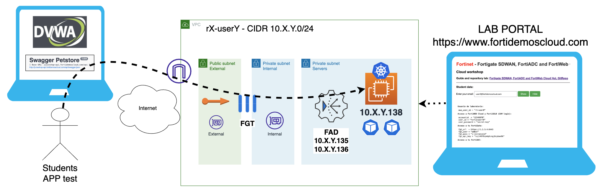</p>

## 0. Acceso al entorno de participante.

### Datos de acceso.
En el portal de formación, introduciendo el email al que has recibido el token del laboratorio, podrás obtener los datos necesarios para completar los pasos siguientes. 

### 0.0. ¿Cómo acceder a vuestro FortiADC?
- En los datos que aparecen en el portal del laboratorio, al introducir tu email, verás las URL de acceso a la GUI de tu FortiADC, habiendo completado el laboratorio 1, verás que es la misma IP pública con la que accedes al FortiGate pero con un puerto diferente. (`fad_url` = https://<ip_management>:8444) 
- El usuario y la contraseña también están detalladas en el portal del laboratorio. En este laboratorio no es necesario resetear la conrtraseña de FortiADC, dado que se ha usado una imagen custom con estos datos preestrablecidos.  

> [!NOTE]
>  Si realizarais el despliegue usando una imagen de Marketplace de AWS, sí sería necesario realizar el reseteo de contraseña, usando el ID de la instancia.

## 1. Publicación de aplicaciones y configuración básica. 
En este primer punto, veremos cómo dar de alta los servidores que contienen las aplicaciones a publicar, de una forma estática y dinámica mediante conectores. Además aprenderás a publicar las aplicaciones a través de FortiADC y seleccionar los métodos y perfiles de seguridad que queremos aplicar.

### 1.1. Configuración de los backend o Real Servers Pools.
Para la configuración del backend de la aplicación a publicar, o Real Server Pool, sobre el que se configuran los Virtual Servers, tenemos diferentes opciones, ya que podemos realizarlo de manera manual dando de alta las IPs de los servidores o automatizarlo usando los `External Connectors`. 

En este laboratorio veremos 3 formas diferentes de realizarlo:

- [1.1.1](#111-configuración-de-real-server-y-real-server-pool-de-manera-manual) Configuración de Real Server Pool de manera manual.
- [1.1.2](#112-configuración-de-real-server-mediante-conector-externo-kubernetes) Configuración de Real Server Pools con connector de AWS. 
- [1.1.3](#113-configuración-de-real-server-mediante-conector-externo-aws) Configuración de Real Server Pools con connector de Kubernetes. 

Con estos pasos, tendremos creados los servidores sobre los que balanceareamos los servicios que publiquemos en el FortiADC. Con la opción manual, los servidores siempre serán los mismos, en cambio mendiante el uso de los conectores, FortiADC podrá balancear el tráfico sobre los servidores que estén desplegados en cada momento, por ejemplo, dentro de un grupo de autoescalado de AWS.  

> [!NOTE]
> Puedes optar por uno de los metodos de configuración o realizar los tres si te ves con ganas. 

#### 1.1.1 Configuración de Real Server y Real Server Pool de manera manual.

#### Paso 1. Real Servers
En el panel lateral, ve a ***Server Load Balance > Real Servers Pool > Real Server*** y haz clic en ***Create New*** para agregar un nuevo servidor.

<p align="center">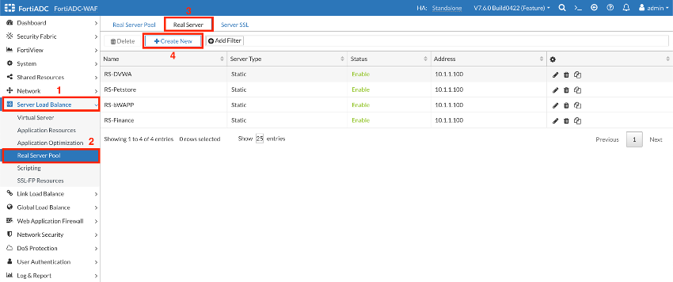</p>

Configura los siguientes valores:
* Name: RS_manual
* Server Type: Selecciona Static.
* Status: Selecciona Enable.
* Type: Selecciona IP
* Address: `IP de tu servidor`

> [!NOTE]
>  Encontrarás la IP de tu servidor en el portal del laboratorio dentro de *Servidor de laboratorio* <10.x.y.138> donde 'x' e 'y' son diferentes para cada alumno.

<p align="center">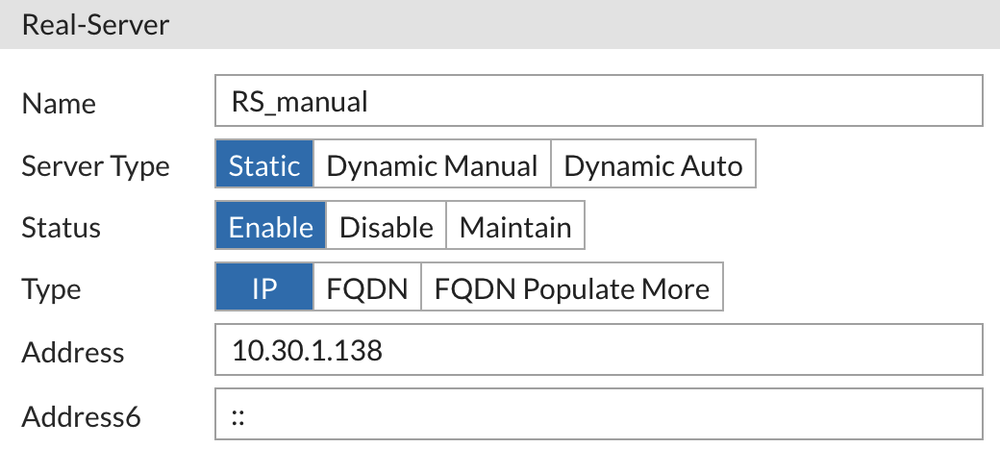</p>

Ahora crearemos el Real Server Pool que incluirá el *Real Server* que acabamos de crear. Añadiremos un Real Server Pool para cada una de las aplicaciones. 

#### Paso 2. Real Server Pools
En el panel lateral, ve a ***Server Load Balance > Real Servers Pool*** y haz clic en ***Create New*** para agregar un nuevo servidor.

Configura los siguientes valores:
* Name: RSP_manual_DVWA
* Address Type: IPv4.
* Type: Static
* Health Check: (Enable)
* Health Check List: (Selecciona LB_HLTHCH_ICMP y añádelo a la columna Selected Items)

<p align="center">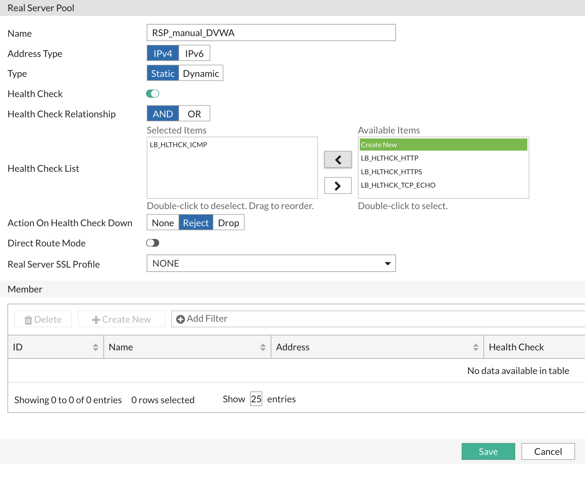</p>

Una vez guardemos esta configuración, ya podremos volver al editar nuestro *Real Server Pool* para añadir el *Real Server* que hemos creado en el paso anterior. 

Selecciona el *Real Server Pool* que acabamos de crear y haz doble click o dale al botón de editar de la derecha. 

En la sección ***Member*** añade el Real Server creado en el paso 1. 

Configura los siguientes valores:
* Status: Enable
* Real Server: (selecciona el Real Server creado)
* Port: 31000
* Health Check Inherit: (Enable)
* RS Profile Inherit: (Enable)

<p align="center">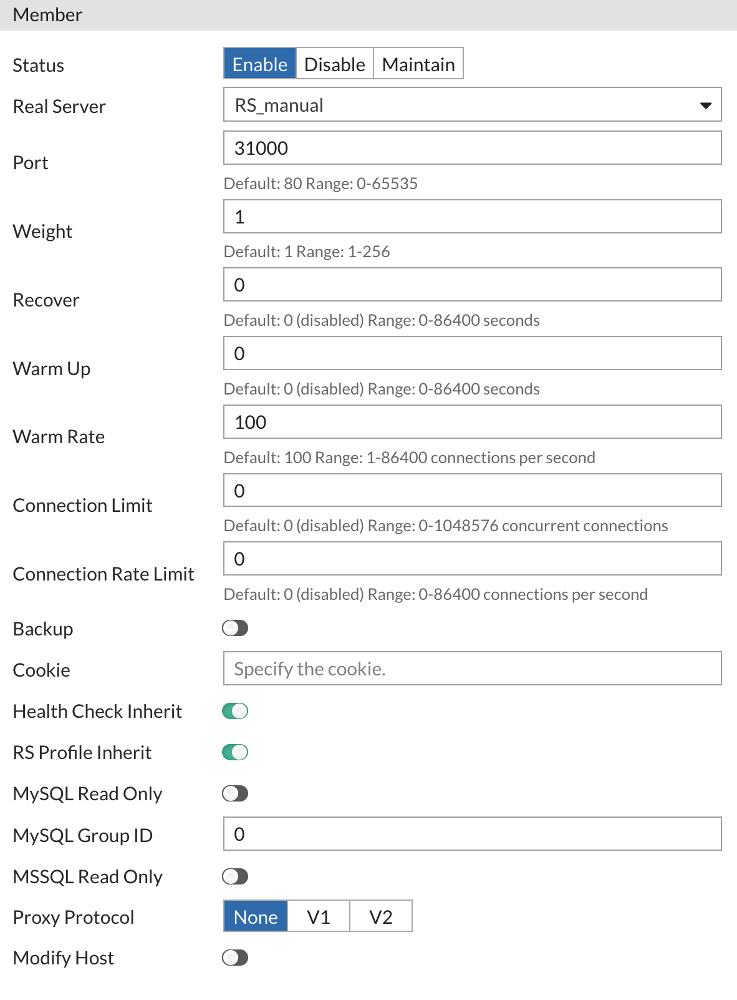</p>

Finalmente guardaremos la configuración de nuestro *Real Server Pool* `RSP_manual_DVWA`

Repiteremos estos pasos para crear un nuevo *Real Server Pool* pero para la aplicación de API llamado `RSP_manual_API` y añadiremos un nuevo miembro una vez configurado pero cambiando el puerto de la aplicación al `31001`

Configura los siguientes valores cuando añadas el nuevo miembro a `RSP_manual_API`
* Status: Enable
* Real Server: (selecciona el Real Server creado)
* Port: `31001`
* Health Check Inherit: (Enable)
* RS Profile Inherit: (Enable)

> [!NOTE]
>  Para la configuración de este laboratorio, habrás observado que el *Real Server* que se añade al *Real Server Pool* es el mismo en ambos casos, correspondiente al nodo de Kubernetes donde corren las dos aplicaciones. El puerto donde se escuchan las aplicaciones corresponde a un servicio tipo Nodeport en el nodo. Algo más común que te podrás encontrar, será tener que configurar más de un *Real Server* o, como veremos en los puntos siguientes, un *Real Server* dinámico. 

Finalmente, en la sección de *Real Server Pool*, deben aparecer los dos grupos de servidores, uno para la aplicación DVWA y otra para la API. 

<p align="center">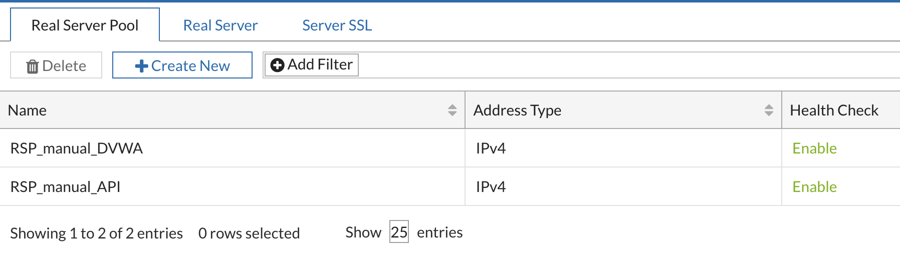</p>

> [!NOTE]
> La creación del *Real Server Pool* mediante conector externo Kubernetes es opcional, si vas mal de tiempo pasa al [punto 1.2](#12-configuracion-del-virtual-sever-vs)

#### 1.1.2 Configuración de Real Serve Pool mediante conector externo Kubernetes.
Con esta opción, integramos el FortiADC con el servicio de Kubernetes que aloja todos los servicios gestionados por el grupo responsable de la aplicación, por medio de un External Connector del Security Fabric. De esta forma en el FortiADC sólo se configurará el *Real Server Pool* y el *Virtual Server*. Los *Real Servers* correspondientes al entorno Kubernetes, se descubrirán mediante el conector y se configurarán de forma automática al pool de servidores como *Real Servers*, sin que tengamos que configurar estos. De esta forma, el administrador de FortiADC, no tiene preocuparse de la infraestructura de servidores que alojan el clúster de Kubernetes. 

#### Paso 1. Creación del conector al clúster Kubernetes.
En el panel lateral, ve a ***Security Fabric > External Connectors***, haz clic en ***Create New*** y seleccionar el conector de Kubernetes.

<p align="center">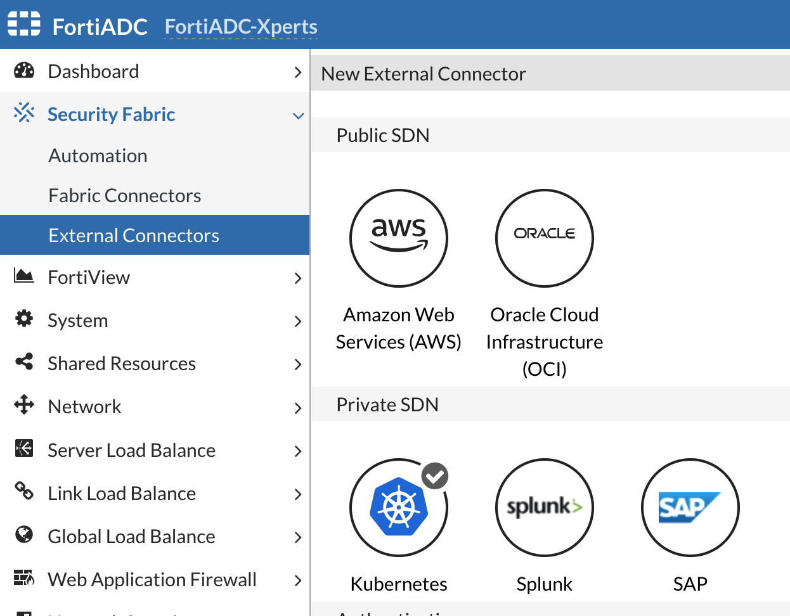</p>

Configurar los siguientes valores:
* Name: SDN_K8S
* Status: Enable
* Update Interval: 30
* Server: `IP de tu servidor`
* Port: 6443
* Secret Token: `Kubernetes connector secret token`

Como siempre, podrás encontrar los datos necesarios en el portal del laboratorio. Recuerda que cada participante tiene los suyos, como la IP del servidor y el secret token. 

Datos a recoger del portal:

<p align="center">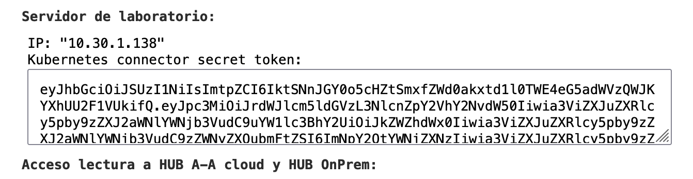</p>

Configuración del conector:

<p align="center">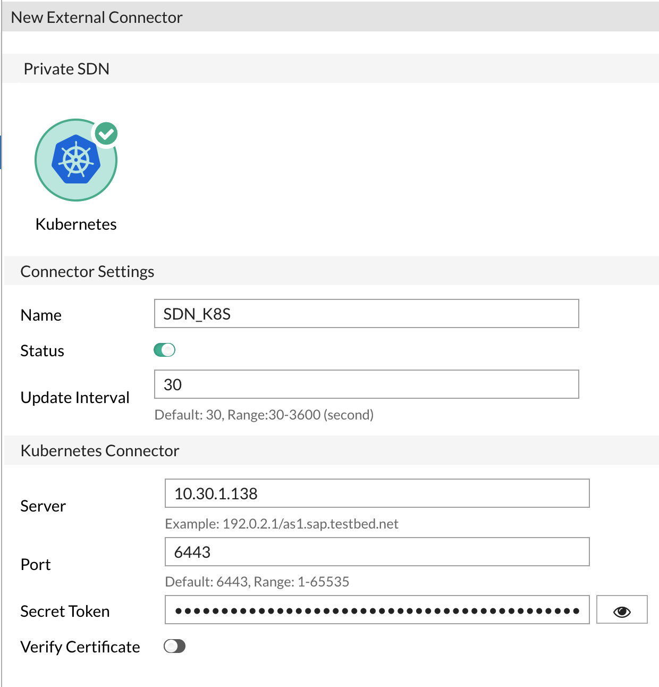</p>

Confirma que el conector aparece en verde tras crearlo: 

<p align="center">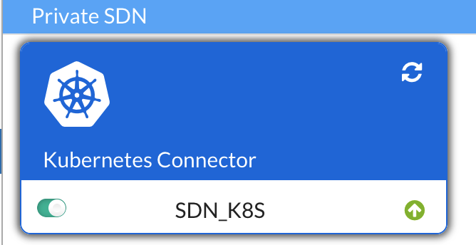</p>

> [!NOTE]
>  Quizás necesites darle al botón de refrescar en el conector sino quieres esperar el tiempo de actualización.

Con estos pasos ya estaría configurado el conector que lee la API de nuestro entorno Kubernetes. 

#### Paso 2. Creación del Real Server Pool.
El siguiente paso es crear un nuevo *Real Server Pool* que use este conector para crear de forma dinámica los *Real Severs* sobre los que se va a balancear el tráfico de la aplicación. Dirígete a ***Server Load Balance > Real Server Pool > Real Server Pool*** y haz clic en ***Create New*** para agregar un nuevo servidor.

Configura los siguientes valores:
* Name: RSP_SDN_K8S_DVWA
* Type: Dynamic
* SDN Connector: (Seleccionar el conector que acabamos de crear)
* Service: (Seleccionar el servicio de la aplicación DVWA, **K8S_ServiceName=dvwa**)
* Health Check: (Enable)
* Health Check List: (Selecciona LB_HLTHCH_ICMP y añádelo a la columna Selected Items)

<p align="center">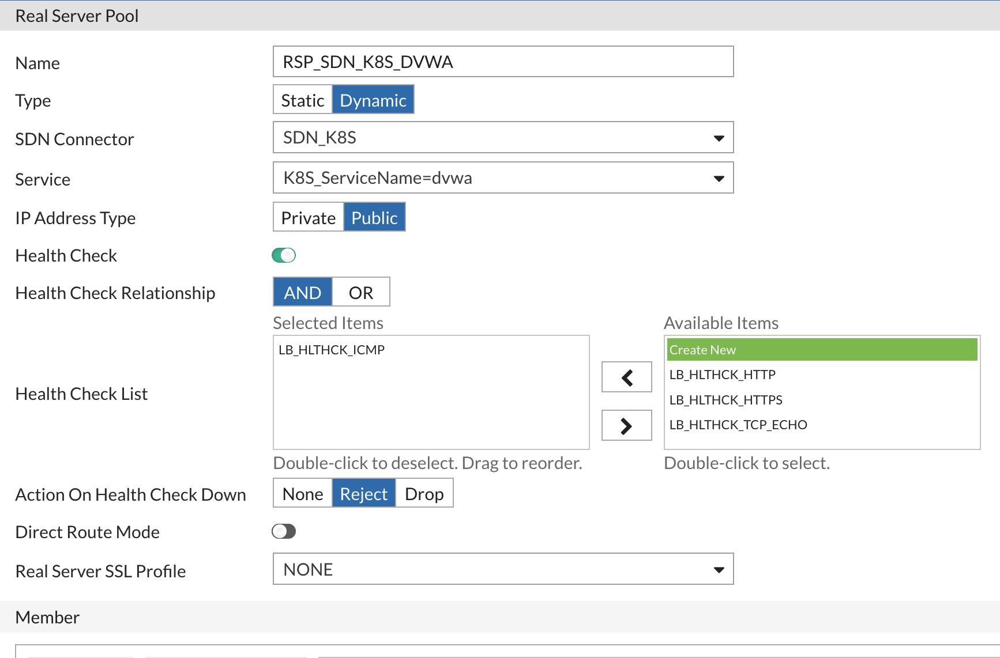</p>

Tras salvar la configuración podrás comprobar como FortiADC se ha conectado de manera automática a la API del entorno Kubernetes, ha descubierto los nodos que tenían el servicio configurado y ha dado de alta de forma automática los servidores sobre los que balancear. No solamente con su IP, sino el puerto en el que está configurado el servicio, que para esta aplicación es el `31000`. 

<p align="center">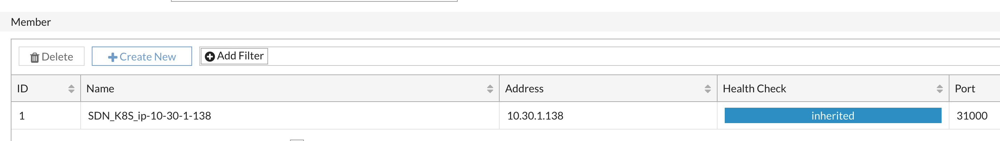</p>

Vuelve a configurar un nuevo *Real Server Pool* para la aplicación de API, los datos serían los mismos que en paso anterior, lo único que debes cambiar es el nombre y seleccionar el servicio. 

Configura los siguientes valores:
* Name: RSP_SDN_K8S_API
* Type: Dynamic
* SDN Connector: (Seleccionar el conector que acabamos de crear)
* Service: (Seleccionar el servicio de la aplicación DVWA, **K8S_ServiceName=swagger-petstore**)
* Health Check: (Enable)
* Health Check List: (Selecciona LB_HLTHCH_ICMP y añádelo a la columna Selected Items)

<p align="center"></p>

Vuelve a comprobar que los *Real Severs* correspondientes a este servicio se han creado correctamente y en el puerto correcto, en este caso el `31001`.

> [!NOTE]
> La creación del *Real Server Pool* mediante conector externo cloud AWS es opcional, si vas mal de tiempo pasa al [punto 1.2](#12-configuracion-del-virtual-sever-vs)

#### 1.1.3 Configuración de Real Server mediante conector externo AWS.
Con esta opción, integraremos el FortiADC con el servicio de Amazon Web Services (AWS) que aloja  los servicios gestionados por el grupo responsable de la aplicación por medio de un External Connector del Security Fabric. De esta forma en el FortiADC sólo se configurará el *Real Server Pool* y el *Virtual Server*. Los *Real Servers* correspondientes al entorno Cloud de AWS, se descubrirán mediante el conector y se configurarán de forma automática al pool de servidores como *Real Servers*, sin que tengamos que configurar estos. De esta forma, el administrador de FortiADC no tiene preocuparse de la infraestructura de servidores que alojan el backend de la aplicación. 

#### Paso 1. Creación del conector cloud AWS.
En el panel lateral, ve a ***Security Fabric > External Connectors***, haz clic en ***Create New*** y seleccionar el conector de AWS.

<p align="center">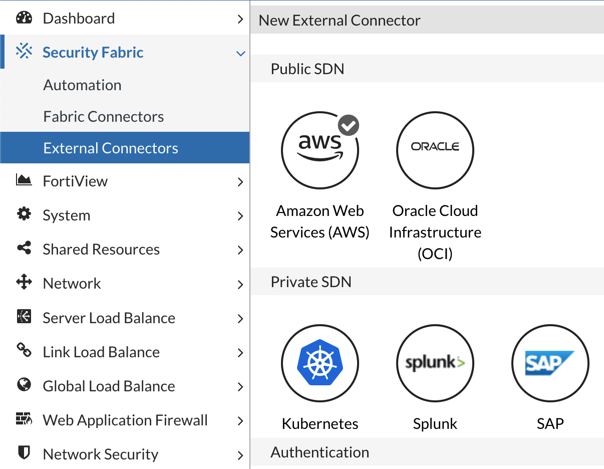</p>

Configurar los siguientes valores:
* Name: SDN_AWS
* Status: (Enable)
* Use Metadata IAM: (Enable)

<p align="center">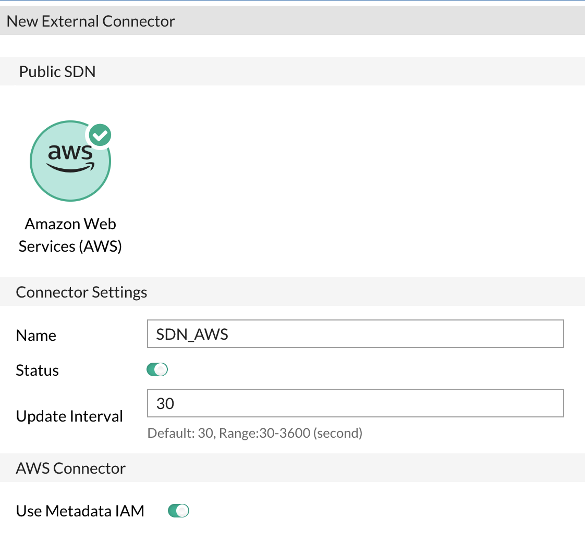</p>

Dado que a tu instancia de FortiADC en AWS le hemos asociado un [IAM Instance profile](https://docs.fortinet.com/document/fortiadc/7.4.5/handbook/748774/amazon-web-services-aws-connector) con los permisos necesarios para leer el entorno de AWS, el conector será capaz de recuperar los servidores de AWS donde está desplegada la aplicación en función del filtro de metadatos que consideremos. 

> [!NOTE]
>  Confirma que el conector aparece en verde tras configurarlo. Si es necesario, pulsa el botón de refrescar el conector.

<p align="center">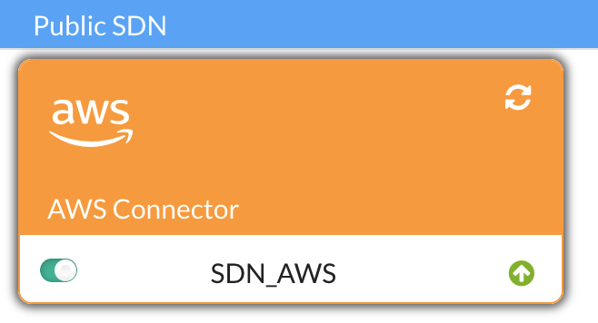</p>

#### Paso 2. Creación del Real Server Pool.
El siguiente paso es crear un nuevo *Real Server Pool* que use este conector para crear de forma dinámica los *Real Severs* sobre los que se va a balancear el tráfico de la aplicación. Dirígete a ***Server Load Balance > Real Server Pool > Real Server Pool*** y haz clic en ***Create New*** para agregar un nuevo servidor.

Configura los siguientes valores:
* Name: RSP_SDN_AWS_DVWA
* Type: Dynamic
* SDN Connector: (Seleccionar el conector SDN_AWS)
* Service: (Seleccionar como filtro el tag: Tag.Owner=`<usuario_laboratorio>`)
* Service Port: `31000`
* IP Address Type: Private
* Health Check: (Enable)
* Health Check List: (Selecciona LB_HLTHCH_ICMP y añádelo a la columna Selected Items)

<p align="center">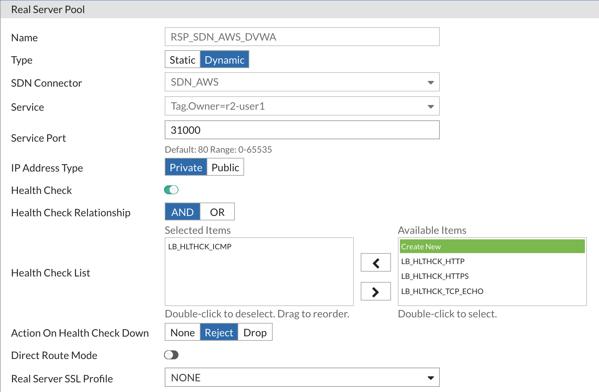</p>

> [!WARNING]
>  Si no seleccionas correctamente tu usuario en el `Tag.Owner` dentro del filtro del conector SDN de AWS, FortiADC leerá la IP del servidor de otro participante, creará el *Real Sever* pero no tendrá conectividad. Además el tipo de IP debe ser Private, haz doble check. 

Vuelve a configurar un nuevo *Real Server Pool* para la aplicación de API, los datos serían los mismos que en paso anterior, lo único que debes cambiar es el nombre y seleccionar el servicio correspondiente. 

Configura los siguientes valores:
* Name: RSP_SDN_AWS_API
* Type: Dynamic
* SDN Connector: (Seleccionar el conector que acabamos de crear)
* Service: (Seleccionar como filtro el tag: Tag.Owner=`<usuario_laboratorio>`)
* Service Port: `31001`
* IP Address Type: Private
* Health Check: (Enable)
* Health Check List: (Selecciona LB_HLTHCH_ICMP y añádelo a la columna Selected Items)

<p align="center">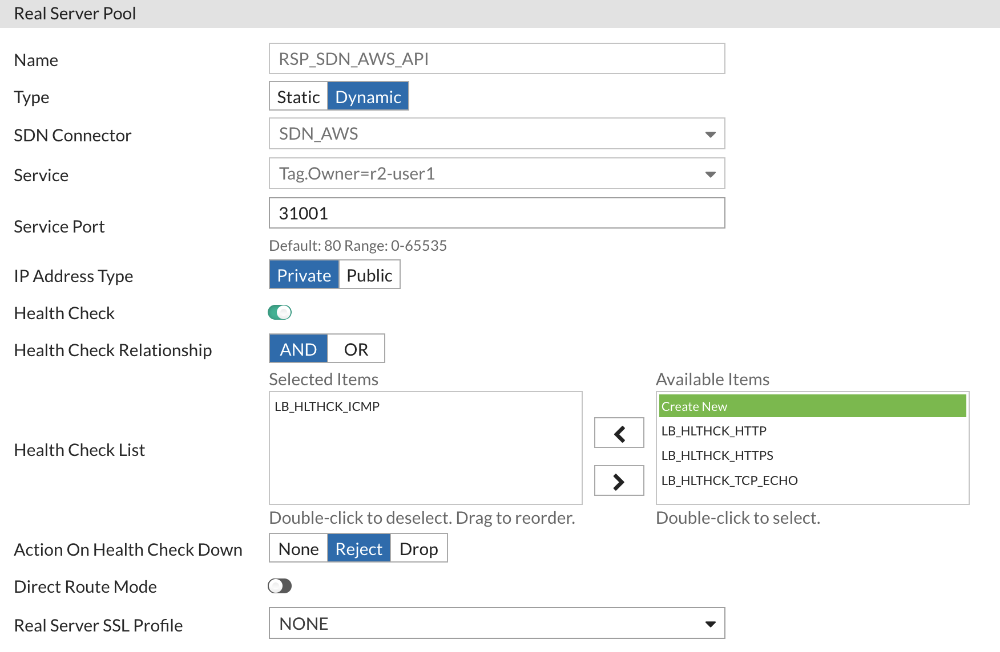</p>

> [!NOTE]
>  Si vas a la sección de *Real Servers* podrás comprobar que se han creado de manera automática dos nuevos *Real Severs* al crear los *Real Server Pools* mediante el conector. En esta práctica sólo dispones de una instancia, pero tanto en el caso del conector Kubernetes como en el de los tags de AWS, si el número de servidores aumentara o disminuyera, se crearían o desactivarían los *Real Servers*. 

<p align="center">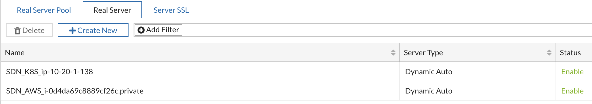</p>

### 1.2 Configuracion del Virtual Sever (VS). 
En el apartado anterior hemos visto como dar de alta los grupos de servidores sobre los que FortiADC enviará el tráfico de aplicación en función de diferentes parámetros, para este laboratorio simplemente por disponibilidad. En un escenario real o de producción, se podrán escoger los criterios de balanceo que se consideren oportunos. [Métodos de balanceo en FortiADC](https://docs.fortinet.com/index.php/document/fortiadc/7.4.4/handbook/201314/configuring-load-balancing-lb-methods)

Ahora vamos a configurar el *Virtual Sever* que escuchará el tráfico de la aplicación y enviará el tráfico al backend o *Real Server Pool* correspondiente. 

#### 1.2.1 Configuración de un pool de IP para Source NAT
Dado que estamos en un entorno donde el tráfico se envía por defecto al FortiGate y no al FortiADC, necesitamos hacer un Source NAT del tráfico procedente del FortiADC para que el servidor responda de forma correcta las peticiones de este. 

Para configurar la IP que nuestro FortiADC usará para enviar las peticiones, nos iremos a la sección ***Virtual Sever > NAT Source Pool*** y haremos click en ***Create New***

<p align="center">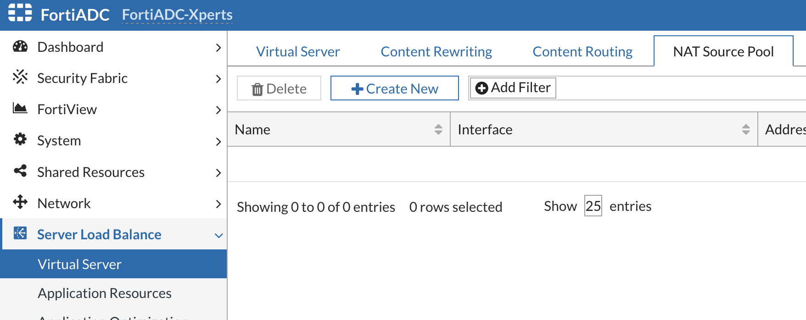</p>

Lo primero sería consultar la IP asignada para NAT a tu FortiADC en el portal del laboratorio, en la sección de datos de acceso a tu FortiADC. 

<p align="center">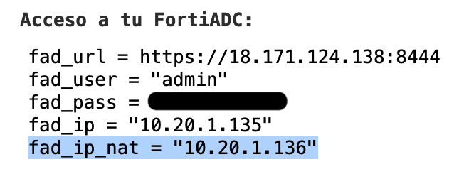</p>

Configura los siguientes valores:
* Name: SNAT
* Interface: port1
* Address Type: IPv4
* Address Range: `<IP de NAT para tu FortiADC>`
* To: `<IP de NAT para tu FortiADC>`

<p align="center">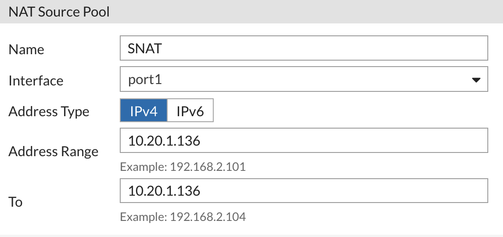</p>

#### 1.2.2 Configuración de un Virtual Server (VS)
Una vez configurado el pool de servidores que comparten un mismo servicio es necesario crear un *Virtual Server* como punto de entrada público al servicio. El servidor virtual recibirá el tráfico y lo distribuirá entre los servidores backend.

Nos iremos a la sección ***Server Load Balance > Virtual Server*** y en la pestaña ***Virtual Server*** haremos click en ***Create New*** con ***Advanced Mode***

<p align="center">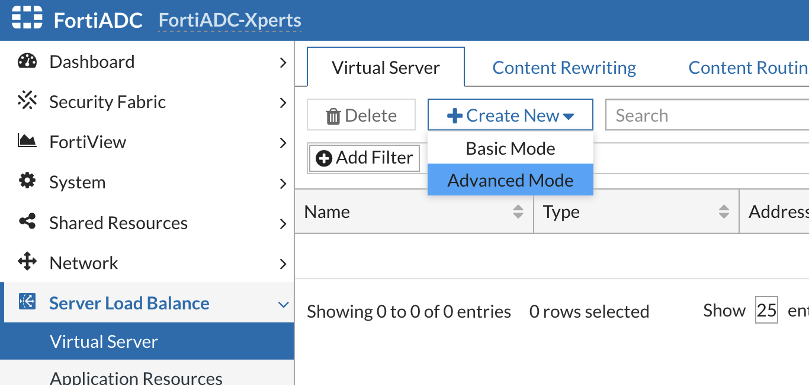</p>

Ahora en la pestaña ***Basic***, configura los siguentes parámetros:

* Name: VS_DVWA
* Type: Layer7
* Status: Enable
* Address Type: IPv4
* NAT Source Pool List: `<SNAT>` (este es el pool de IPs que hemos creado en el paso anterior, debes añadirlo a la columna *Selected Items*)

<p align="center">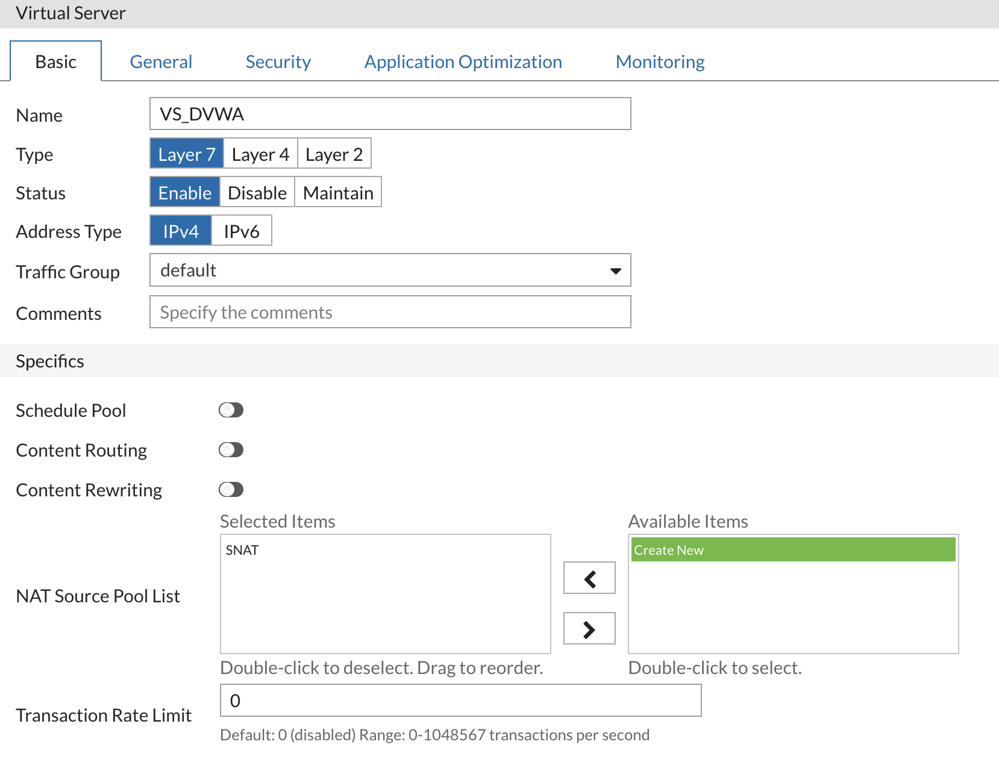</p>

Ahora en la pestaña ***General***, configura los siguentes parámetros:
* Address: `<IP de tu FortiADC>`
* Port: `31010`
* Interface: Port1
* Profile: LB_PROF_HTTP
* Persistence: LB_PERSIS_HASH_COOKIE
* Method: LB_METHOD_ROUND_ROBIN
* Real Server Pool: `<DVWA>` (puedes usar cualquier de los *Real Server Pool* creados para la aplicación DVWA en el punto 1.1)

<p align="center">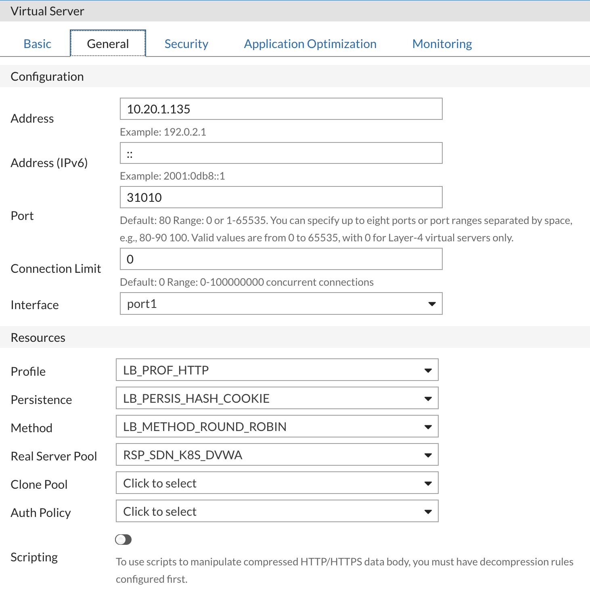</p>

Ahora en la pestaña ***Monitoring***, configura los siguentes parámetros:
* Traffic Log: (enable)
* FortiView: (enable)

Finalmente salva la configuración para este nuevo Virtual Server. 

Comprueba que tienes acceso la aplicación DVWA a través del FortiADC, los datos de acceso los puedes encontrar el portal del laboratorio. 
`Acceso a tus aplicaciones a través de FortiADC: `
`dvwa_url  = http://YOUR_PUBLIC_IP:31010 `

> [!NOTE]
>  Opcionalmente puedes crear también el VS para la aplicación API, repitiendo los pasos anteriores pero publicando en el puerto `31011`. 

#### 1.2.3 Monitorización de un Virtual Server (VS)
Si has completado los pasos [1.1.1](#111-configuración-de-real-server-y-real-server-pool-de-manera-manual) y [1.1.2](#112-configuración-de-real-server-mediante-conector-externo-kubernetes) correctamente, podrás comprobar el estado de salud del nuevo VS que acabas de crear. 

Nos iremos a la sección ***FortiView > Logical Topology*** y en el tab ***Server Load Balancer*** veremos la topología con el detalle del puerto de escucha del servicio, el backend sobre el que se balancea el tráfico y el estado de salud de los servidores de backend.  

<p align="center">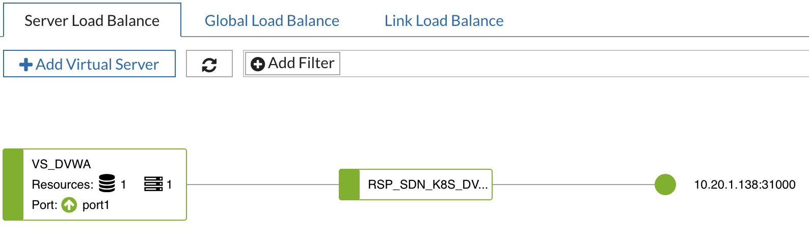</p>

Otra sección interesante para monitorizar la aplicación dentro de ***FortiView*** y la experiencia de los usuarios de la misma, es ***FortiView > Virtual Server***. Aquí vamos a poder encontrar un listado con todas nuestras aplicaciones y datos interesantes para su análisis. 

Para obtener un mayor detalle a nivel de logs, es posible configurar los niveles de logeo y tipo que queremos registrar. Para ello, en el panel izquierdo, ve a ***Log & Report > Log Setting*** y, en la pestaña ***Local Log***, activa los siguientes parámetros:
* Event: (enable)
* Traffic: (enable)
* Event Category: (activa el check *Enable All*)
* Security: (enable)
* Security Category: (activa el check *Enable All*)

#### Generación de tráfico contra la aplicación
Para generar tráfico random contra la aplicación y empezar a tener logs en el FortiADC, hemos prepardo un script que puedes lanzar para generar este tráfico, [Dvwa_XP24.sh](./scripts/Dvwa_XP24.sh). (Si copias el script en tu PC, MAC o Linux deberás darle permisos de ejecución antes de ejecutarlo) 

1. chmod + x ./Dvwa_XP24.sh
2. ./Dvwa_XP24.sh `<fortiadc_ip_publica>` `<puerto>`
3. Una vez ejecutado el script elegiremos la opcion 1. Esta opción hará un login en DVWA y capturará tanto la SessionID como el user_token que se necesitan para hacer log

<p align="center">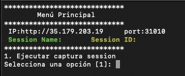</p>

<p align="center">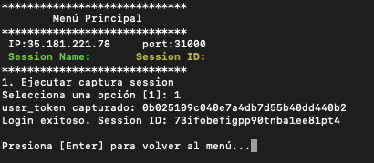</p>

4. Después aparecerá un nuevo menú, con mas opciones. Entre ellas podemos activar un debug, desactivarlo, ejecutar Adaptative Learning.

<p align="center">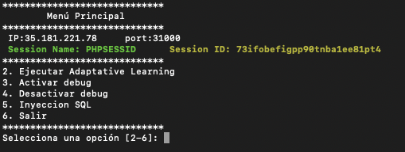</p>

5. Para generar tráfico, sería opción 2. Y te pedirá número de repeticiones que se quiere enviar. Con 20 es suficiente.
6. Para ver el tráfico que se genera, activar antes el debug.

> [!NOTE]
> Si no te es posible ejecutar el script en tu PC, no te preocupes y sigue con los siguentes pasos, desde el laboratorio estamos lanzando tráfico contra vuestras aplicaciones, por lo que deben aparecer logs en el momento en que la aplicación sea accesible. 

Ahora podrás revisar los logs de tráfico de la aplicación desde ***Log & Report > Taffic Log*** y realizar los filtrados que consideremos oportunos. (Recuerda generar tráfico contra la aplicación para que se registren logs contra la misma)

A modo de ejemplo, selecciona la opción SLB HTTP del desplegable, haz clic en el icono de la última columna e identifica los siguientes valores:
* IP y puerto del cliente
* IP y puerto de destino del servicio
* Método empleado
* URL solicitada
* Virtual Server al que se está realizando la consulta.
* Real server que está gestionando el tráfico
* Código de respuesta

## 2. Configuraciones avanzadas y nuevas funcionalidades de FortiADC.

### 2.1 Adaptive Learning (AL)
El Adaptive Learning es una funcionalidad avanzada que permite al FortiADC aprender y adaptarse automáticamente a los patrones de tráfico y comportamiento de las aplicaciones web que gestiona. Esta característica utiliza análisis basados en Inteligencia Artificial para identificar de manera continua qué es "normal" para una aplicación en particular y ajusta las políticas de seguridad en consecuencia. Esto permite que FortiADC proporcione protección optimizada sin una intervención manual constante.

En este laboratorio aprenderemos a configurar y gestionar políticas de AL sobre los VS anteriormente creados.

#### 2.1.1 Configuración de política de AL.
Para configurar una nueva política de AL, selecciona en el panel lateral izquierdo ***Web Application Firewall > Adaptive Learning*** y haz clic en ***Create New*** para agregar una nueva política.
	
Configura los siguientes valores:
* Name: AL
* Status: (enable) (al activarlo nos dejará seleccionar los siguientes valores)
* Sampling Rate: `100` (Es el porcentaje en % de muestras que va a utilizar para construir las recomendaciones)
* False Positive Threshold: `2` (Ver nota)
* Least Learning Timer: `5` (Periodo de tiempo de aprendizaje en minutos)
* Action: Deny

No olvides guardar.

> [!NOTE]
> False Positive Threshold: es el umbral a partir del cual los eventos activados deben considerarse falsos positivos, es decir, si recibimos una infracción de X número de diferentes fuentes, siendo X el valor configurado durante el Least Learning Time, se reconocerá ese evento como un falso positivo y la recomendación será la de desactivar esa firma.

Al guardar, nos dejará configurar el apartado de ***URL List*** donde crearemos una nueva URL asociada a la política de AL, hacemos click en ***Create New** y configuramos los siguientes valores:
* Host Status: (enable)
* Host: <ip_publica_servicio:puerto_aplicacion> (la IP pública y el puerto corresponde al acceso a través de FortiADC en el portal del curso `ip_publica:31010`) 
* URL: /* (aplica a todos los paths disponibles) 

No olvides guardar.

#### 2.1.2 Configuración del perfil de WAF. 
Las políticas de *Adaptative Learning (AD)* se asocian a perfiles de WAF que aplicaremos a las aplicaciones publicadas. Por lo que tendremos que crear un nuevo perfil de WAF que tenga asociada la política de AD que hemos creado en el paso anterior [2.1.1](#211-configuración-de-política-de-al) 

Para crear un nuevo profile de WAF, ve al panel lateral izquierdo ***Web Application Firewall > WAF Profile*** y dentro de la pestaña de ***WAF Profile*** haz clic en ***Create New***

Configurar los siguientes valores:
* Name: `WAF_PROFILE`
* Adaptive Learning: AL (aquí aparecerá la política creada en el paso 1.3.1)

Tras salvar y crear el nuevo profile, ya lo tendremos disponible para aplicar al Virtual Server. 

#### 2.1.3 Asignación del perfil de WAF a Virtual Server.
A continuación, asignaremos el perfil WAF a un Virtual Server. En el panel lateral izquierdo, ve a ***Server Load Balance > Virtual Server*** y haz doble clic sobre `VS_DVWA` para editar el VS que hemos creado en el punto [1.2.2](#122-configuración-de-un-virtual-server-vs)

Configurar los siguientes valores dentro de la pestaña ***Security***
* WAF Profile: `WAF_PROFILE` (este es el profile de WAF que hemos generado en el punto [2.1.2](#212-configuración-del-perfil-de-waf))

No olvides guardar.

#### 2.1.4 Test sobre la aplicación y comprobación de resultados.

#### Paso 1. Generación de tráfico.
En el apartado de Monitorización, punto [1.2.3](#123-monitorización-de-un-virtual-server-vs) se ejecutó el script *user_traffic.sh* para generar tráfico random sobre la aplicación, puedes volver a ejecutarlo y esperar al menos 5 minutos antes de continuar.

#### Paso 2. Comprobación de resultados.

Una vez esperado unos 5 minutos irémos a ver que recomendaciones nos hace el Adaptive Learning para nuestra aplicaciones con la muestra de tráfico que hemos genrado. Para verlo tenemos que ir a ***Web Application Firewall > Adaptive Learning View*** , donde veremos que hemos tenido Hits y el arbol de nuestra página

<p align="center">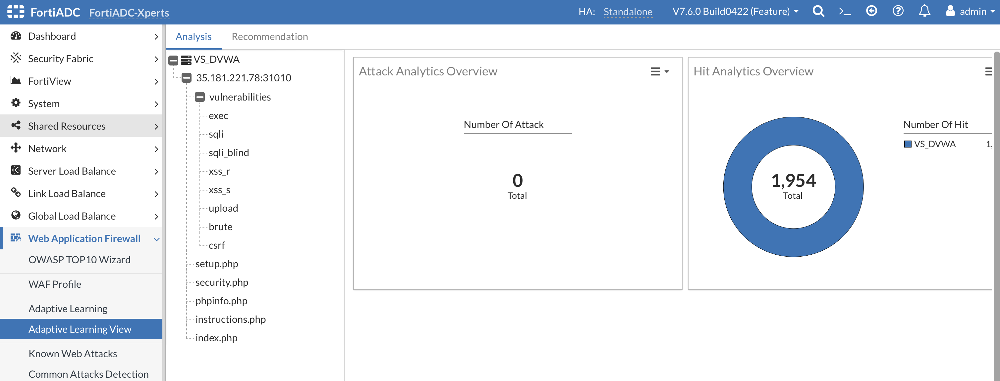</p>

Pinchamos en la pestana ***Recommendation*** y nos apareceran dos recomendaciones:
	1. Attacks Signature
 	2. Bot Detection

<p align="center"></p>

En ambas, tenemos que aceptarlas haciendo doble click sobre el icono final. Y ***Acept***

<p align="center">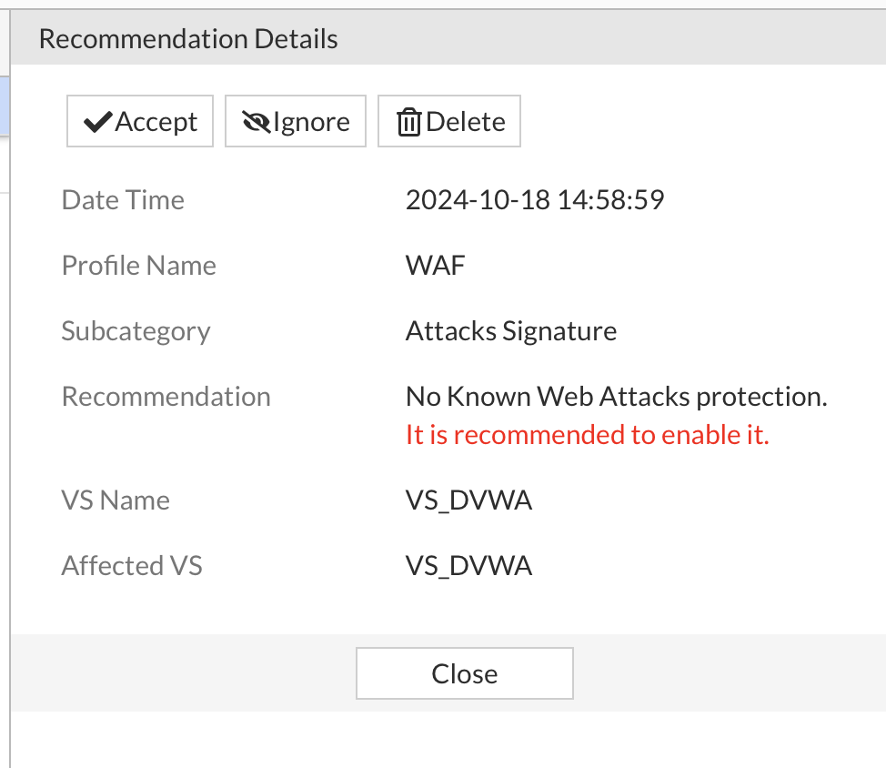</p>
<p align="center">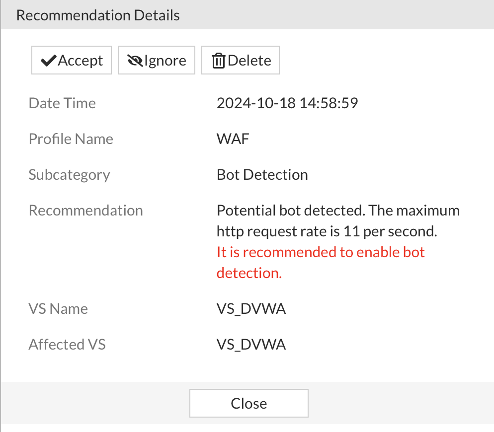</p>

Una vez aceptadas podremos comprobar que en nuestro perfil de waf anterior mente creado ***WAF***, nos apareceran asignado un Web Attack Signature y Bot Detection con nombre: ***AL_GEN_2024XXXXXXXXX***

### 2.2 OWASP Top 10 Compliance.
Esta funcionalidad está relacionada con la visibilidad y el compliance de nuestros servicios balanceados por el FortiADC y nos proporcionará el grado de cumplimiento que tienen nuestros perfiles WAF frente a las amenazas de OWASP Top 10 y, en caso de no estar lo suficientemente protegido, que políticas aplicar y que cambios en el perfil son necesarios para llegar a alcanzar el nivel de cumplimiento frente a los diferentes ataques de OWASP.

#### 2.2.1 Habilitar funcionalidad en FortiADC.
OWASP Top 10 Compliance está disponible desde la versión 7.6 y, antes de poder usarla, es necesario habilitarla. Para ello, en el panel lateral izquierdo ir a ***System > Settings*** y en la pestaña Basic habilitar OWASP Top 10 Compliance. A partir de ahora, se podrá acceder desde el panel lateral a ***FortiView > OWASP Top 10 Compliance***. 

Como se puede observar, por cada *Virtual Server* se establece un grado de cumplimiento de OWASP Top 10 representado en la columna *Compliance Rate*, el valor número reflejado indica en cuantos tipos de amenazas estamos protegidos al 100%. Si se hace doble clic sobre el Virtual Server se obtendrá información detallada del tanto por cien cubierto para cada una de las diferentes amenazas de OWASP Top 10 así como aquellas configuraciones que faltan para incrementar la protección.

#### 2.2.2 Configuración de perfiles de Cookie Security y Data Loss Prevention.
A continuación, se detalla la configuración a aplicar sobre el perfil WAF creado en los pasos anteriores para mejorar la protección sobre A02:2021-Cryptographic Failures y como se incrementa el grado de cumplimiento de la aplicación.

Como se puede ver, el grado de cumplimiento para esta amenaza es del 60%, y se indica que falta por configurar ***Cookie Security y Data Loss Prevention***. Vamos a configurar estos valores para, posteriormente, ver como incrementamos el perfil de seguridad.

#### Paso 1. Cookie Security.
En el panel lateral ir a ***Web Application Firewall > Sensitive Data Protection*** y, en la pestaña de Cookie Security, hacer click en ***Create New*** 

Configurar los siguientes parámetros:
* Name: CS
* Security Mode: Encrypted

El resto de parámetros dejarlos por defecto y hacer click en ***Save***. Esto habilitará ***Cookie List***. Hacer click en ***Create New***

Configurar los siguientes parámetros:
* Name: `XS24`

Hacer click en ***Save***

#### Paso 2. Data Loss Prevention.
Ahora en el panel lateral izquierdo ir a ***Web Application Firewall > Data Loss Prevention*** y en la pestaña de ***DLP Policy*** hacer click en ***Create New***

Configurar los siguientes datos:
* Name: `DLP`
* Status: Enabled
* Action: Alert

Hacer click en ***Save***. Eso habilitará la posibilidad de configurar las ***Rules***

En el apartado de ***Rules*** hacer click sobre ***Create New*** 

Configurar los siguiente parámetros:
* Type: Sensitive Data Type
* URL Pattern: /*
* Sensitive Data Type: Credit_Card_Number
* Threshold: 1

Hacer click en ***Save*** hasta salir completamente de los menús de configuración. 

#### 2.2.3 Asignación de nuevos elementos al WAF Profile
El siguiente paso es asignar los nuevos elementos de protección a WAF profile. 

En el panel lateral ir a ***Web Application Firewall > WAF Profile*** hacer doble click sobre `WAF_PROFILE`.

Configurar los siguiente parámetros:
* Cookie Security: `CS` (este es el perfil que hemos creado en el punto [2.2.2 paso 1](#paso-1-cookie-security)) 
* Data Loss Prevention: `DLP` (este es el perfil que hemos creado en el punto [2.2.2 paso 2](#paso-2-data-loss-prevention)) 

Ir a ***FortiView > OWASP Top 10 Compliance*** y verificar el valor de la columna *Compliance Rate*. 

Con esta configuración mejoraremos el compliance para *A02:2021-Cryptographic Failures* al 100% y se dará un valor de 4 sobre 10 para el Virtual Server configurado. Para ello debemos esperar a que el *Adaptive Learning* termine de crear las recomendaciones sobre nuestra aplicación y aplicar las mismas.  

Una vez aplicadas las recomendaciones del *Adaptive Learning, Cookie Security y Data Loss Prevention* como hemos visto, si volvemos al Virtual Server, podremos comprobar como en el apartado de A02:2021-Cryptographic Failures todas las políticas de seguridad están seleccionadas en verde y está cubierto al 100%.

### 2.3 IP BAN en FortiGate
Es habitual que los servicios expuestos a Internet, como aplicaciones públicas, sean los primeros en sufrir ataques. Gracias a la integración con FortiGate y la configuración de Automation Stitches, que realizaremos en este laboratorio, veremos cómo somos capaces de bloquear durante un tiempo definido la dirección IP que atacó a los servicios balanceados por el FortiADC. 

### 2.3.1 Creación de usuario API en FortiGate
Para que FortiADC pueda indicar al FortiGate que IPs bloquear, es necesario que el FortiADC tenga acceso como administrador de tipo API sobre el FortiGate.

En el portal del laboratorio puedes encontrar la API que hemos cargado en la configuración de bootstrap de tu FortiGate, dentro de la sección ***Acceso a tu Fortigate*** la entrada ***fgt_api_key***, esta API key está asociada a un perfil de administrador.  

Si prefieres crear tu propia API key para practicar dentro del FortiGate, el proceso de configuración es el siguiente:
1. Acceder a la IP de tu FortiGate: https://<IP_FortiGate>:8443 (puedes encontrar el acceso en el portal del laboratorio)
2. En el panel lateral acceder a ***System > Administrators*** y hacer click en ***Create New*** y seleccionar ***REST API Admin***.
3. Puedes selecciónar como ***Administrator profile*** el profile *api_admin_profile* que ya hemos cargado para el laboratorio o crear el tuyo propio. 

<p align="center">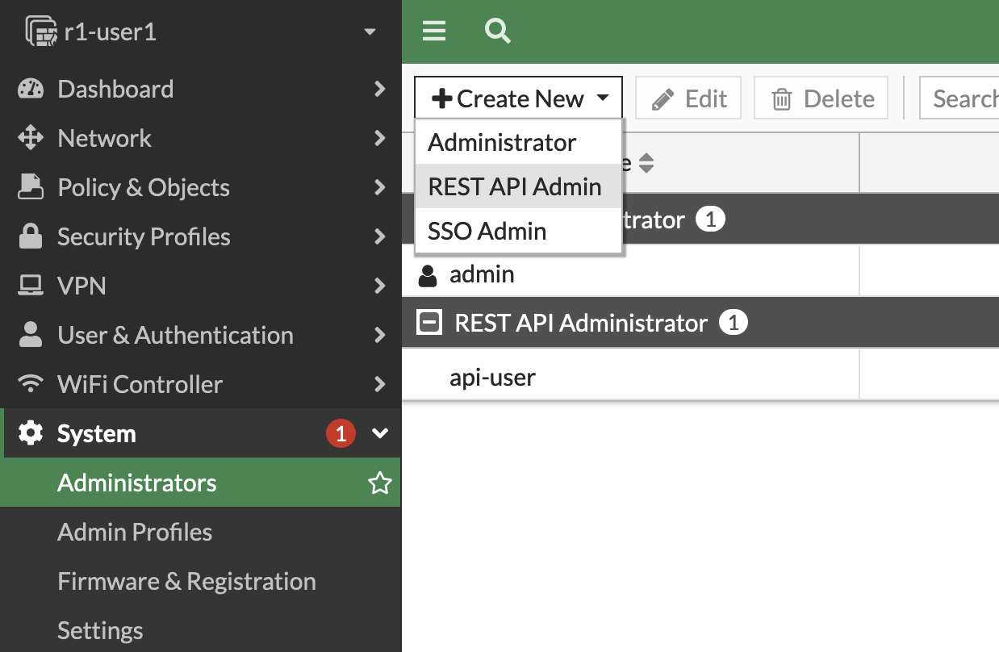</p>

### 2.3.2 Configuración de Action
Para configurar una nueva *Action* dentro de FortiADC, seleccionar en el panel lateral izquierdo ***Web Application Firewall > WAF Profile*** y la pestaña de ***Action*** y hacer clic en ***Create New***

Configurar los siguientes valores:
* Name: `fgt-bannedIP-100s`
* Action Type: Period Block
* Deny Code: 403
* Log status: Enable
* Period Block: 100

Hacer click en ***Save***

### 2.3.3 Asignación de Action
Vamos a asignar la acción configurada a una amenaza, en este caso al tipo de ataque SQL/XSS Injection. En el panel lateral, ve a ***Web Application Firewall > Common Attacks Detection***, seleccionar la pestaña de SQL/XSS Injection Detection y hacer click en ***Create New***

Configurar los siguientes valores:
* Name: `XS24_SQL_Policy`
* Habilitar la opción ***SQL Injection Detection***
* Dentro del menú que aparecerá de *SQL Injection Detection* habilitar las opciones de *URI Detection, Referer Detection, Cookie Detection, Body Detection*.
* Action: `fgt-bannedIP-100s`

Resto de valores dejarlos por defecto y hacer click en ***Save***

Ahora asignaremos la política al perfil WAF.

En el panel lateral, ir a ***Web Application Firewall > WAF Profile*** y hacer doble click sobre `WAF_PROFILE`

Configurar los siguientes valores:
* SQL/XSS Injection Detection: `XS24_SQL_Policy`

Hacer click en ***Save***

### 2.3.5 Creación del Automatismo

Vamos a crear ahora la automatización para que la IP maliciosa detectada en el WAF sea bloqueda en el FortiGate. Para ello realizaremos los siguientes pasos:

#### Paso 1. Configuración de la acción.
En el panel lateral ir a ***Security Fabric > Automation*** hacer click en la pestaña de ***Action*** y pulsar sobre ***Create New*** y seleccionar ***FortiGate IP Ban***

<p align="center">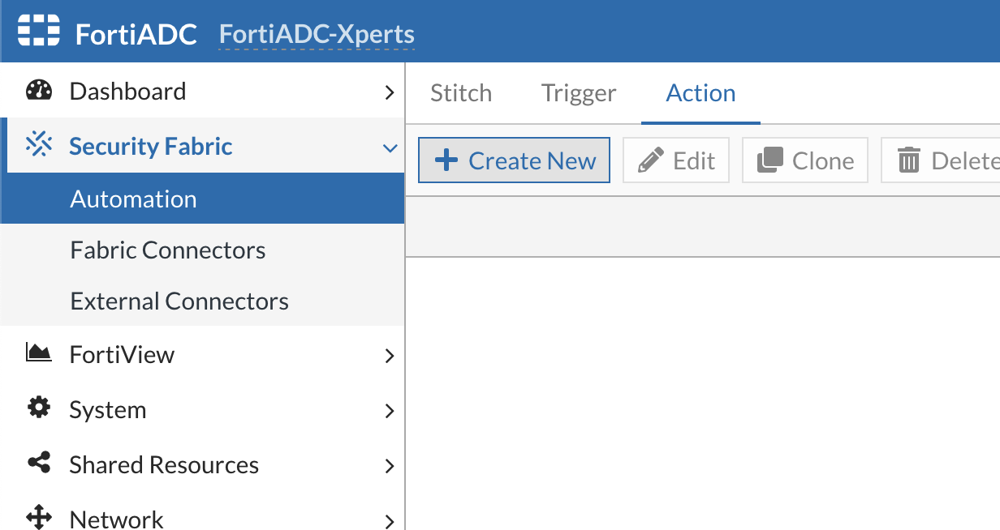</p>

Configurar los siguientes valores:
* Name: `FGT_IPBAN`
* FortiGate Token: (usa el token que aparece en el portal del laboratorio o el que has creado en el punto [2.3.1](#231-creación-de-usuario-api-en-fortigate))
* FortiGate URL: `fgt_api_url` (este dato aparece en el portal del laboratorio en la sección de **Acceso a tu FortiGate**)

<p align="center">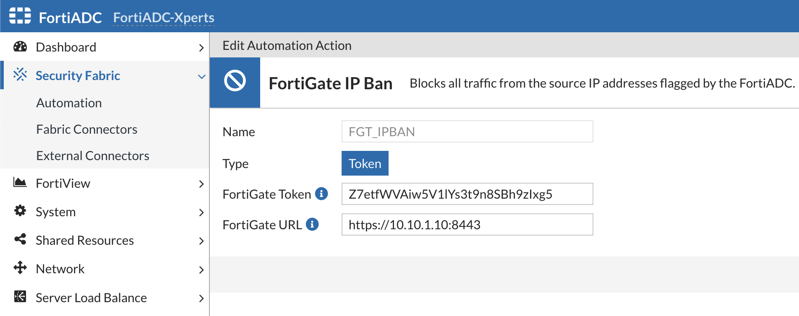</p>

> [!NOTE]
> Dado que el FortiADC y el FortiGate tienen conectividad privada, la URL de la API del FortiGate corresponde a la IP privada del puerto 1, donde hemos habilitado el acceso HTTPS. 

#### Paso 2. Configuración del Stitch.
En el panel lateral ir a ***Security Fabric > Automation*** hacer click en la pestaña de ***Stitch*** y pulsar sobre ***Create New***

<p align="center">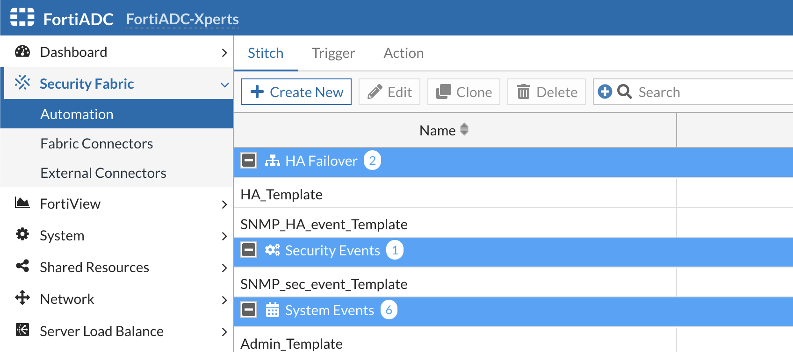</p>

Configurar los siguientes valores:
* Name: `FGT_IPBAN`

Ahora añadiremos el trigger:
* `Add Trigger`: seleccionar ***Period Block IP*** y darle a ***Ok***

<p align="center">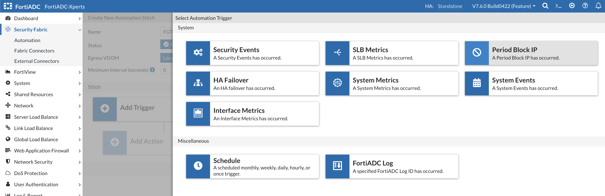</p>

Ahora añadiremos la acción:
* `Add Action`: seleccionar ***Fortigate IP Ban*** y darle a ***Ok***

<p align="center">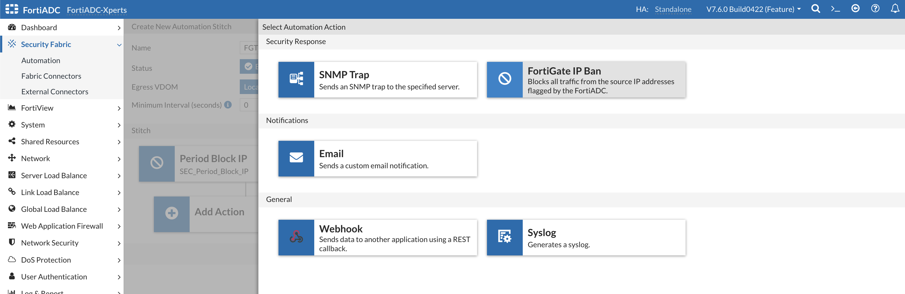</p>

Configurar los siguentes valores:
* Name: `FGT_IPBAN`
* Alert: (Seleccionar del listado la acción configurada en el [paso 1](#paso-1-configuración-de-la-acción) `FGT_IPBAN`)

<p align="center">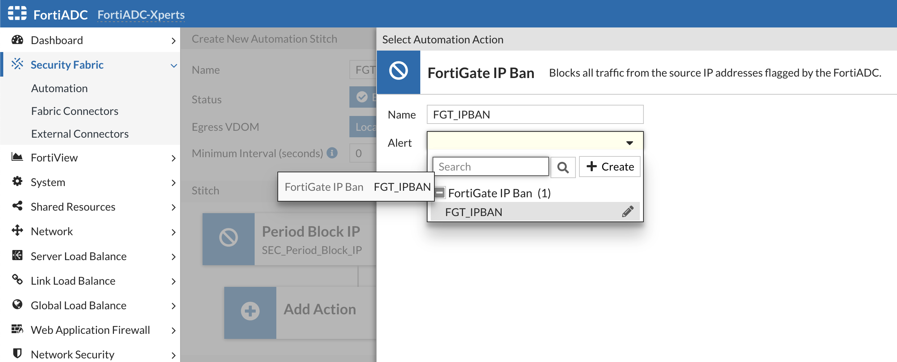</p>

Finalmente guardamos la configuración haciendo click en ***Ok***

> [!NOTE]
> Recuerda que en el punto [2.3.2](#232-configuración-de-action) y [2.3.3](#233-asignación-de-action) asociamos la acción de bloquear una IP por 100s a un profile de WAF, este será el que detecte y lance el trigger de banear IP, al detectar un ataque de *SQL injection*. 

### 2.3.6 Comprobación de baneo de IP
En este punto vamos a lanzar un ataque de tipo SQL Injection y vamos a verificar como se realiza el bloqueo de la IP en el FortiGate. Para ello lanzaremos el siguiente ataque sobre nuestra aplicación desplegada:

```sh
curl "http://<IP_PUBLICA_DEL_SERVICIO>:31010/vulnerabilities/sqli/?id=Hello+%27+or+%271%27%3D%271%27+union+select+user+%2C+password+from+users+%23&Submit=Submit#" -v -k
```
Accede a tu FortiGate y navega a ***Dashboard > Quarentine Monitor***. Comprueba como aparece vuestra IP Pública e intenta acceder a la aplicación via Web. El acceso estará bloqueado durante 100 segundos en los que no tendrás acceso.

## Laboratorio completado
Una vez concluído este laboratorio es hora de pasar al laboratorio 3: [FortiWeb](https://github.com/xpertsummit/xpertsummit24/tree/main/FortiWeb)
