## [FortiDAST](./)

En este laboratorio llevaremos a cabo las siguientes tareas:

- Integración con FortiDAST para llevar a cabo el análisis de vulnerabilidades de nuestro portal web
- Validación de propiedad de la aplicación a escanear
- Comprobación de los resultados del análisis en FortiDAST

## 1. Integración con FortiDAST

- Seleccionamos nuestro portal web desde FortiWeb Cloud
- Accedemos a la sección Vulnerability Scan

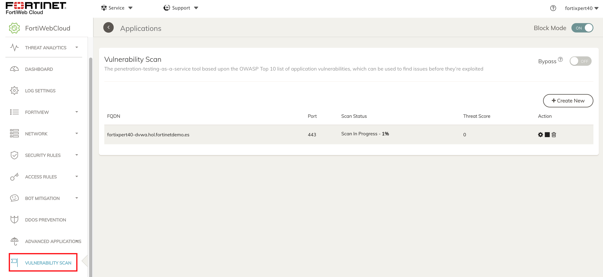

- Damos de alta nuestra aplicación para el escaneo

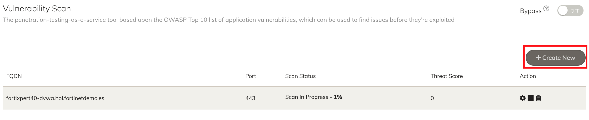
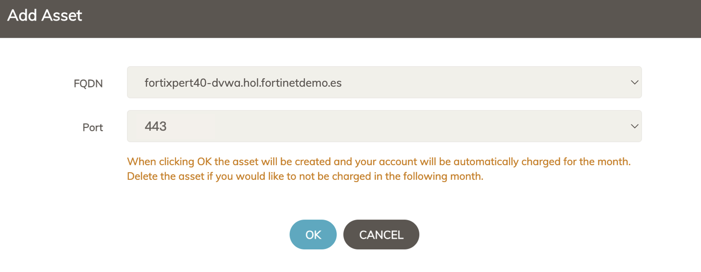

- Seleccionamos la opción _Bypass_ para que el análisis se salte los controles que aplica FortiWeb sobre la aplicación

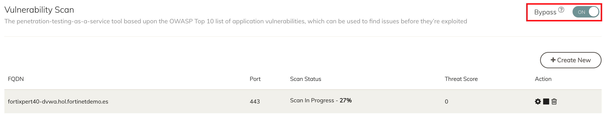

- El escaneo quedará pendiente de autorización para ser lanzado. Para ello debemos acceder a la configuración del análisis que nos dará acceso a FortiDAST

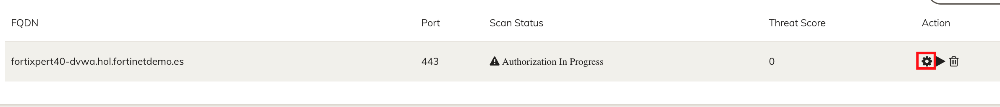

- En FortiDAST nos aparecerá pre-configurado el análisis para lanzarle a la aplicación donde simplemente tendremos que seleccionar Ok
 
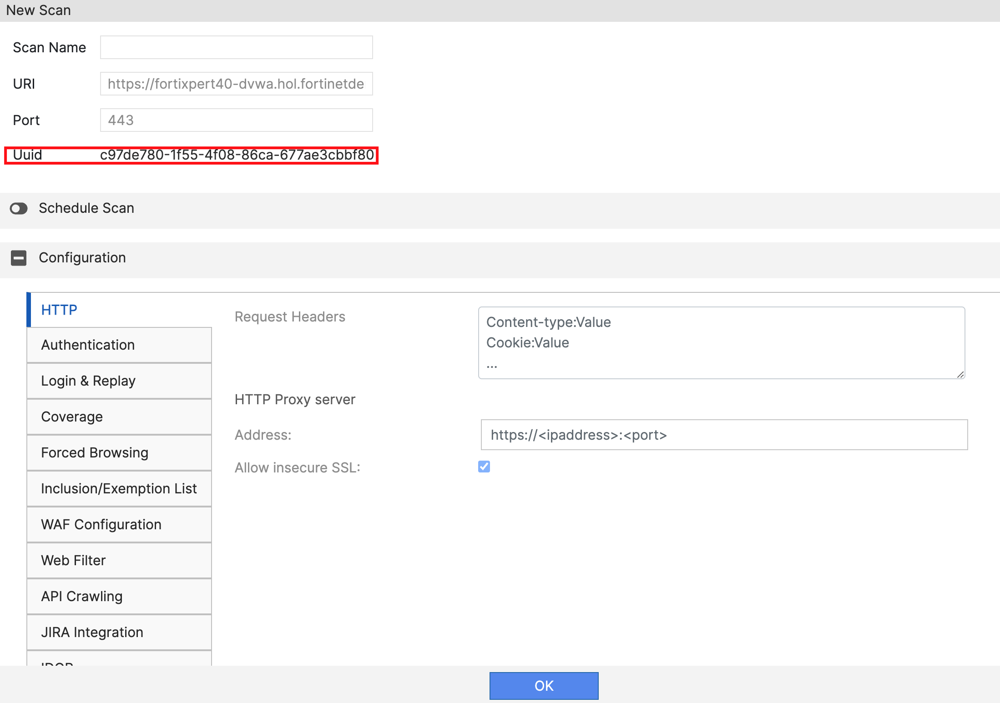

## 2. Lanzamiento de escaneo

- Una vez autorizada la aplicación en FortiWeb Cloud ya tendremos la opción de lanzar el escaneo

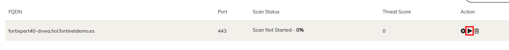

- Si todo ha ido bien en FortiDAST veremos como el escaneo cambia de estado pasando a _In Progress_
- Podremos acceder al escaneo e ir viendo su evolución desde la opción _View_
- FortiDAST analizará el número de URLs y tecnologías empleadas en la aplicación para ajustar automáticamente los análisis

> [!TIP]
El escaneo llevará unos minutos, puedes aprovechar ese momento para ir familiarizándote con el entorno de FortiDAST o de otras funcionalidades de FortiWeb Cloud

- Si accedemos a _Scan Results_ podemos ir viendo la evolución del análisis tanto a nivel general (_Summary_) como para cada una de las URIs a analizar (_Vulnerabilities_)

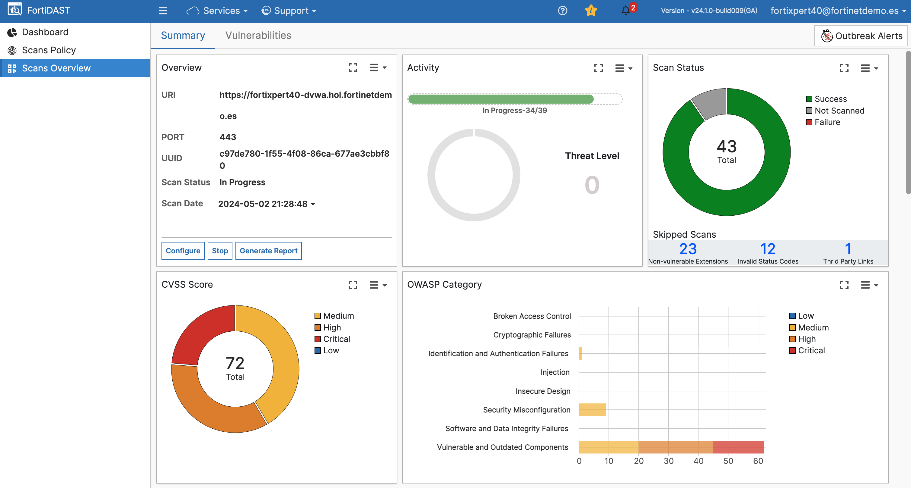
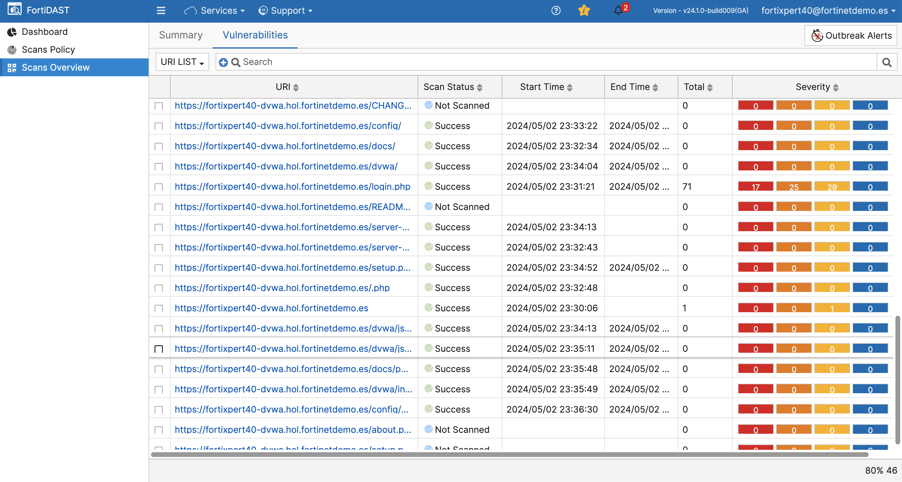

- Podemos ver el detalle de los resultados de cada URI pinchando directamente sobre cada una de ellas:

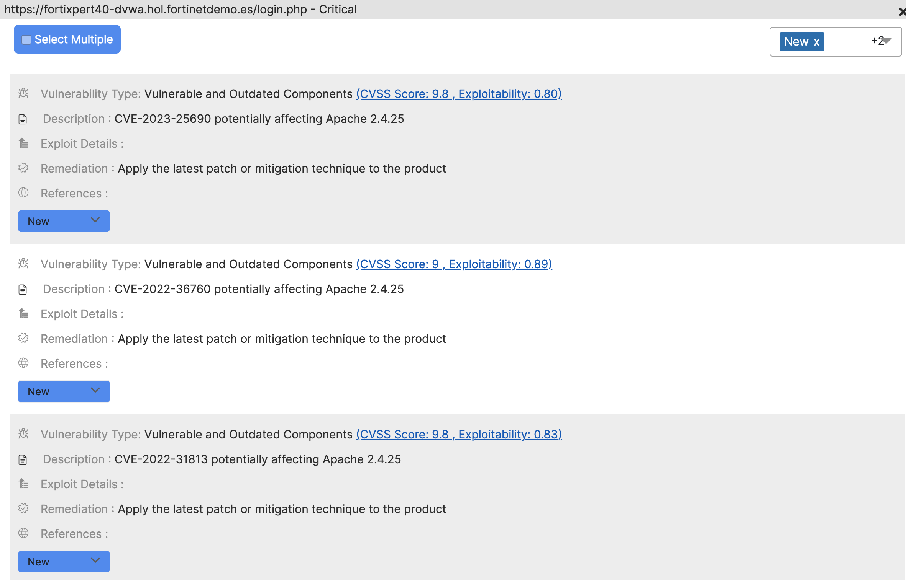

- En las diferentes vistas podemos ver los diferentes descubrimientos por nivel de criticidad (CVSS), Categoría OWASP o SANS, Tecnologías descubiertas,...
- Una vez concluido el análisis podremos ver el _Threat Score_ que nos asigna la herramienta de forma sencilla

- También es posible generar un completo informe con los resultados en formato PDF
- 
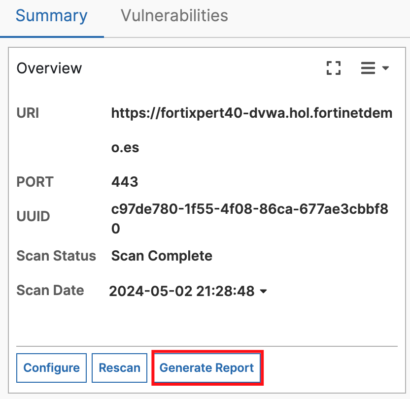

- La integración con FortiWeb facilita dichos resultados directamente sobre la propia interfaz de FortiWeb Cloud tanto a nivel de Threat Score como de acceso directo a los resultados

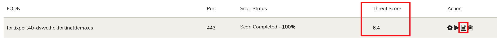

- Con esto concluye este laboratorio de FortiDAST y con él la parte del workshop dedicada a Seguridad para aplicaciones web y API

## Laboratorio completado
Laboratorio completado. 