## [FortiGSLB](./)

En este laboratorio llevaremos a cabo las siguientes tareas:
- Dar de alta nuestra aplicación como server del servicio GSLB.
- Añadir nueevo virtual server al servicio GSLB ya configurado en FortiGSLB.

## Diagram solution

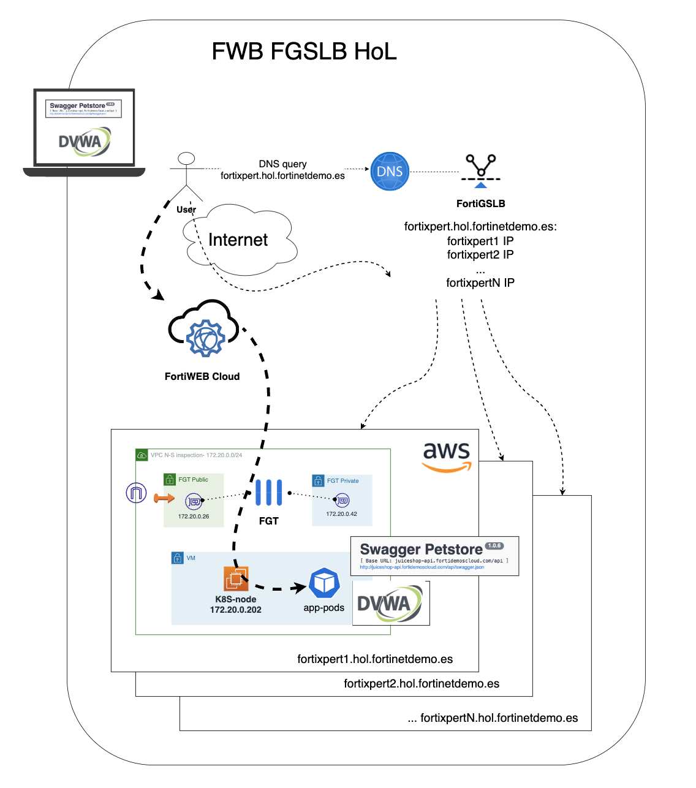

# LAB
## Pasos a seguir:

## 1. Conexión al servicio de FortiGSLB
- En el portal de laboratorio, se ha asigando a cada participante una credencial de FortiCloud.

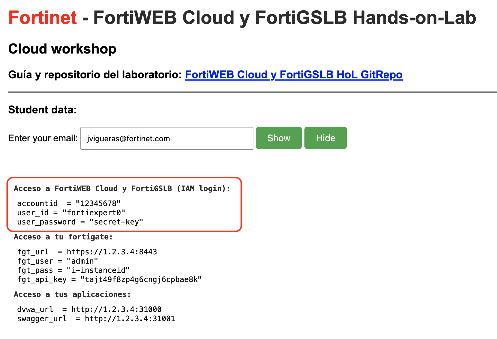

- Con esas credenciales acceder al servicio SaaS de FortiGSLB en la url [FortiGSLB](https://www.fortigslb.com/#/login)

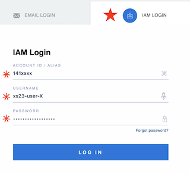

## 2. Acceso a la organización 
- En la página de bienvenida solicitará acceder a una organización. Hemos creado una para este laboratorio: `HoL`


## 3. Creación de conector y servidor
- Desde FortiGSLB podemos configurar un conector a nuestros Fortigates o FortiADC desplegados en diferentes data centers. 
- El paso previo a dar de alta un nuevo servidor de origen para la resulución DNS, es crear un nuevo conector. 

### 3.1. Nuevo conector
- Desde el menú de la izquierda seleccionaremos `Fabric Connectors`

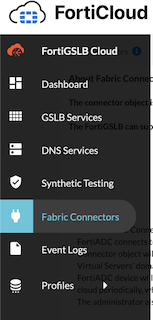

- Una vez dentro de la sección `Fabric Connectors` crearemos un nuevo conector del tipo Fortigate.

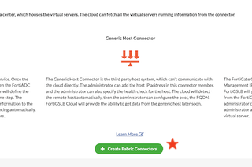

- Los campos necesarios a completar son los siguientes:

  1. Name: `user_id` (Usuario asignado para el laboratorio, ejemplo: fortixpert1)
  2. Data Center: (escoge el correspondiente a tu región)
  3. Address IPv4: (IP de **management** del fortigate, `fgt_url`) 
  4. Port: `8443` (puerto de gestión del fortigate)
  5. Type: `FortiGate`
  6. Sync Control: `Virtual Server`
  7. Auth Tokent: (api_key de tu fortigate, `fgt_api_key`)

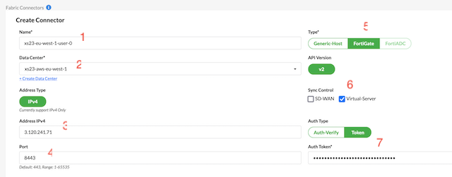

- Recuerda darle a `Save`

### 3.2. Nuevo servidor
- Completado el paso 3.1 y tras darle a salvar, nos aparecerá una nueva opción para asociar un nuevo miembre o servidor a este conector.

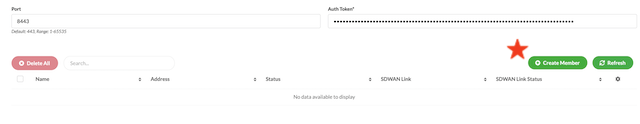

- Los datos que necesitamos completar son los siguientes:

  1. Name: `user_id` (user_id asignado para el laboratorio)
  2. IP Address: (IP **pública** del fortigate, `fgt_ip`) 

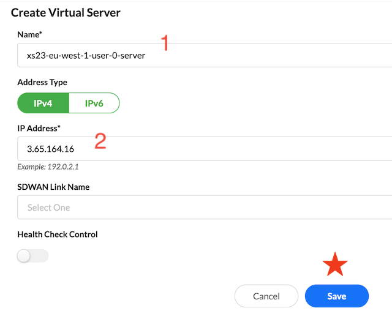

- Recuerda darle a `Save`


## 4. Añadir nuestro servidor al pool students
- Para que el servicio de GSLB incluya al nuevo servidor, debemos añadirlo a la lista de servidores del pool. 
- Seleccionamos en el menú de la izquierda  `Profiles > Pool`

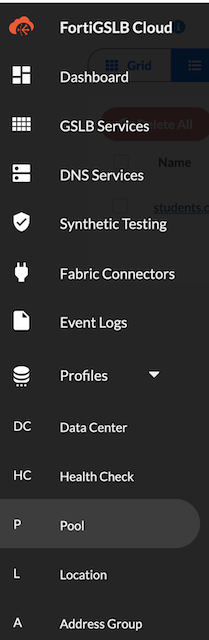

- Dentro de los Pools configurados, seleccionaremos `student-pool` y clicaremos en el botón de editar. 

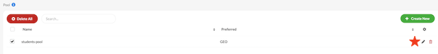

- Una vez dentro del pool nos iremos a `Create Member` para añadir el nuevo servidor 

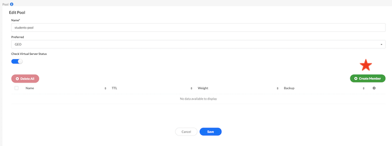

- En el desplegable `Virtual Server` buscaremos el servidor que acabamos de crear en pasos anteriores.

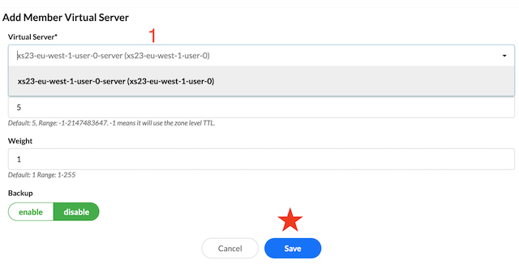

- Recuerda darle a `Save`

Con estos pasos, nuestro servidor acaba de añadirse al pool `student-pool`. Este pool, es el que se ha configurado para la resolución de nombres del FQDN: `fortixpert.hol.fortidemoscloud.com`, de forma que cuando se realizan consultas DNS a FortiGSLB, resolverá con las IPs del pool con orden dependiente de la region del cliente que realiza las consultas. Esto es así porque hemos configurado un servicio GSLB con balanceo tipo GEO. 

Puedes consultar esta configuraicón desde el menú del izquierda en `GSLB Services`

***NOTA: recuerda no modificar otras configuraciones para no entorpercer el trabajo de tus compañeros***

## 5. Comprobar resolución DNS

- Se puede lanzar la consulta DNS para el FQDN `fortixpert.hol.fortidemoscloud.com` para comprobar las IPs resueltas. 

- Para lanzar la consulta directamente a FortiGSLB, es posible consultar directamente a nuestra instancia FortiGSLB por su IP anycast. 

```sh
dig fortixpert.hol.fortidemoscloud.com

dig @75.2.49.209 fortixpert.hol.fortidemoscloud.com
```

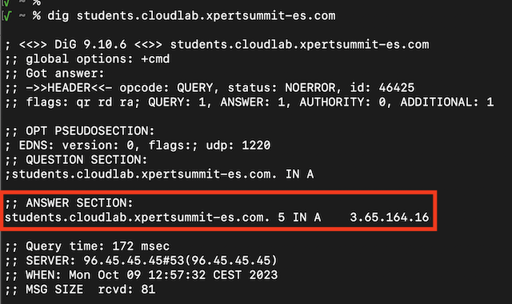

## Laboratorio completado
Has finalizado con éxito el laboratorio de FortiGSLB

