## [FortiGate Cloud Networking](./)
@NetDevOps, @SDWAN, @AWS Transit Gateway, @disponibilidad global

En este laboratorio llevaremos a cabo las siguientes tareas:

- Conocer como integrar la tecnología lider SDWAN de Fortinet en un entorno Cloud.
- Integración con elementos de routing de los Cloud Providers, en este caso AWS Transit Gateway (TGW)
- Entender las diferentes tablas de rutas a configurar en el AWS TGW para diferenciar tráfico de pre y post inspección por los Fortigates.
- Uso de AWS TGW attachment connect para habilitar routing dinámico BGP entre el cluster de Fortigates y AWS.
- Troubleshooting de IPSEC y routing a nivel FortiGate. 
- Creación de objetos dinámicos basados en metadatos Cloud, como por ejemplo tags, para usarlos en politicas de firewall. 

## Resumen puesta en marcha

Se han desplegado una serie de recursos por participante, de cara a facilitar la realización del laboratorio: 
- 1 x VPC, con un CIDR diferente especifico, además de los Security Groups (SG) y tablas de rutas necesarias. 
- 1 x fortigate con los interfaces necesarios en cada subnet, sus SG asociados y la configuración SDWAN necesaria para conectar a los HUBs.
- 1 x servidor kubernetes con dos aplicaciones de test desplegadas. 

> [!NOTE]
> Los detalles de despliegue son diferentes para cada participante.

> [!NOTE]
> Todos los recursos del laboratorio se han desplegado via Terraform, si estas interesado en IaC, tenemos laboratorios especificos. 

## Diagrama del laboratorio

<p align="center">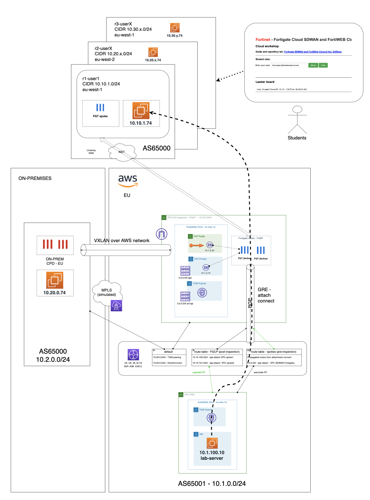</p>

## 1. Acceso al entorno de participante.

### Datos de acceso.
En el portal de formación, introduciendo el email al que has recibido el token del laboratorio, podrás obtener los datos necesarios para completar los pasos siguientes. 

### 1.0. ¿Cómo acceder al Fortigate?
- En los datos que aparecen en el portal del laboratorio, al introducir tu email, verás los URL de acceso a la GUI de tu fortigate. (`fgt_mgmt_url`) 
- Al acceder solicitará resetear la contraseña. La contraseña inicial es el ID de la instancia EC2 del fortigate, que puedes obtener también en el portal del laboratorio. (`fgt_pass`) 

<p align="center">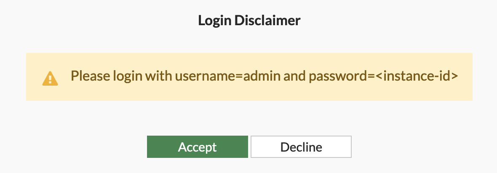</p>

- Resetear password:

<p align="center">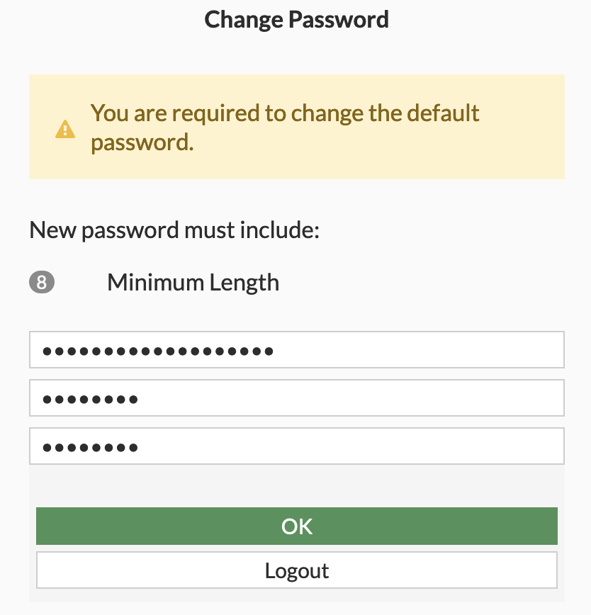</p>

> [!NOTE]
>  Tendrás que completar una serie de preguntas inicial del wizard de inicio, donde puedes dejar por defecto todas las opciones. 

### 1.1. Comprobación de conectividad a los HUBs

Para este laboratorio se ha desplegado una topologia compleja de conexión de *dual HUB*, donde se ha simulando uno de los HUBs en un datacenter on-premises, con una configuración de cluster FGCP activo-pasivo. El otro HUB estaría en un Public Cloud, en este caso AWS, formando un cluster FGSP activo-activo con integración via BGP con un AWS Transit Gateway para publicación de rutas al entorno Cloud. 

> [!NOTE]
> La conexión al HUB desplegado en AWS, que forma un cluster FGSP activo-activo, se ha balanceado usando GSLB contra las IP publicas de cada uno de los nodos. Esta es una opción válida cuando tenemos este tipo de despligue y queremos balancear las conexiones IPSEC contra cada nodo del cluster y que para el Spoke sea transparente. 

- Comprobación de las conexiones a los HUBs VPN:

**Via GUI**

- Desde menú `Dashboard` > Network > panel SD-WAN:

<p align="center">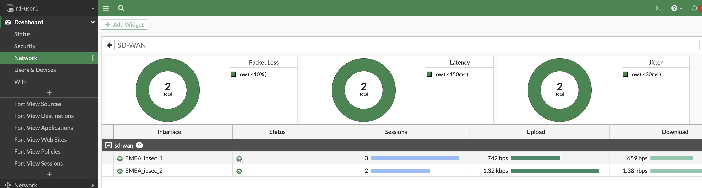</p>

- Desde menú `Dashboard` > Network > panel Routing:

<p align="center">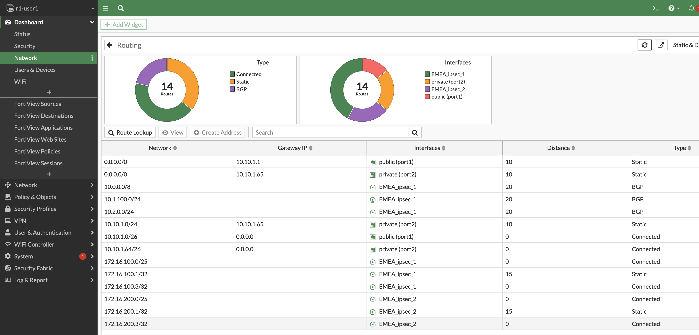</p>

- Desde menú `Network` > `SD-WAN`:

<p align="center">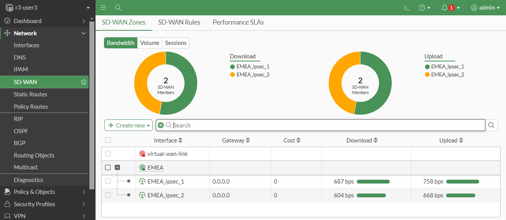</p>

- Desde menú `VPN` > `IPsec Tunnels`:

<p align="center">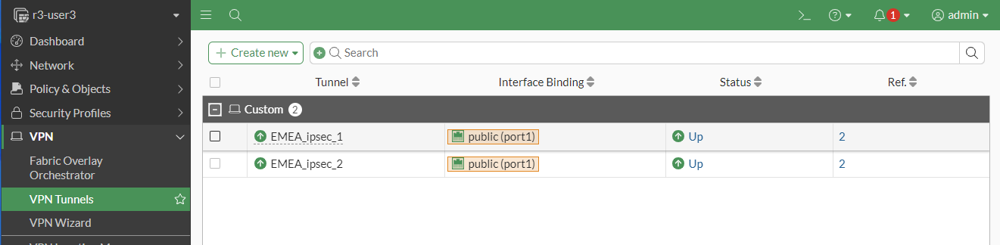</p>

**Via CLI**

- Puedes abrir uno o varios terminales de consola desde la GUI:

<p align="center">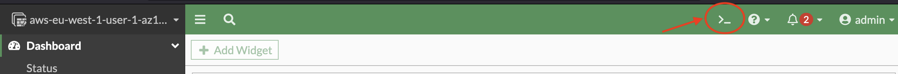</p>

- Comandos interesantes para troubleshooting de VPN IPSEC:
```sh
get vpn ipsec tunnel summary
diagnose vpn ike errors | grep request
```

> [!TIP]
>  Con este último comando ya puedes tener una pista de por qué no están levantados los túneles contra los HUBs :)

- Para revisar la configuración de los túneles IPSEC, puedes ir  a la sección del menú de la izquierda en VPN > IPsec Tunnels

<p align="center">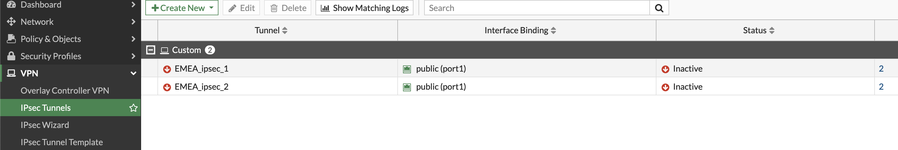</p>

- Para acceder a la configuración de cada uno de los túneles IPsec, simplemente selecciona el túnel y dale a Edit o haz doble click. Dentro de la configuración podrás revisar parámetros como `Remote Gateway`

<p align="center">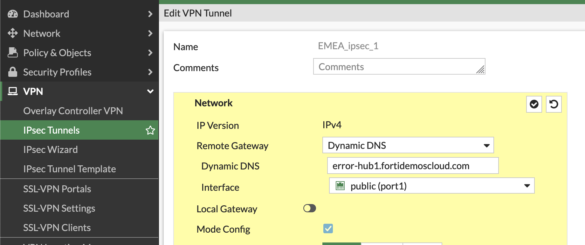</p>

> [!IMPORTANT]
> El FQDN de los HUBs que deben estar configurados en los túnles IPsec con: `hub1.fortidemoscloud.com` y `hub2.fortidemoscloud.com`.

> [!WARNING]
> No olvides darle a Ok para guardar los cambios.


- Comandos interesantes para troubleshooting de BGP:

```sh
get router info bgp summary
get router info routing-table bgp
get router info bgp neighbors 172.16.100.1 ad
get router info bgp neighbors 172.16.100.1 ro
```

### 1.2. Comprobación de conectividad con el servidor local

- Conexión local contra el servidor (ejecutar desde consola Fortigate)
```sh
execute ping 10.x.x.138
execute telnet 10.x.x.138 31000
diagnose sniffer packet any 'host 10.x.x.138' 4
```
Recuerda que la IP de tu servidor depende de tu rango CIDR asignado, en todo caso, puedes encontrar la IP de tu servidor en el portal del laboratorio, en la sección **Servidor de laboratorio**
ej. 10.10.1.138 asignado al user 1 en la region 1
ej. 10.20.5.138 asignado al user 5 en la region 2


### 1.3 Comprobar que vuestro usuario ya aparece en la Leader Board del portal

> [!NOTE]
> Vuestro usuario todavía no aparecerá en el Leader Board llegados a este punto, aunque has sido capaz de realizar un troubleshooting de conectividad IPSEC, todavía falta realizar una configuración adicional para permitir la conectividad entre el servidor del laboratio y vuestro servidor. Esto es debido, a que se ha configurado una regla de firewall permitiendo el tráfico contra un destino que hace referencia a un objeto dinámico, apuntando a un tag de tu servidor, pero, NO está configurado correctamente. 

Ve a la sección de politicas de seguridad `Policy & Objects` > `Firewal Policy`, desde allí verás una regla configurada con un signo de alerta indicando el problema. (Te recomiendo la vista `Interface Pair View` que puedes activar en la parte derecha).

<p align="center">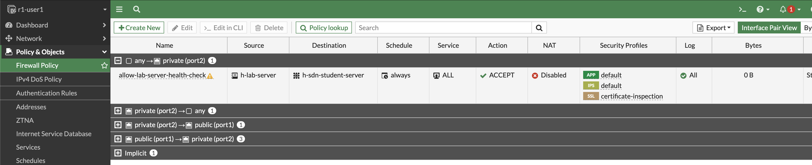</p>

Para actualizar el valor del objeto dinámico, puedes hacerlo directamente desde la sección de `Firewall Policy`, dejando el curso sobre el `objeto sdn-student-server` y cliclando en `Edit` o desde el menú `Policy & Objects` > `Addresses`

<p align="center"></p>

Selecciona en el filtro del objeto dinámico el TAG correcto con contenga tu nombre de usuario, que será algo como esto: `r1-user-1` y que puedes encontrar en el portal del laboratorio en la sección **Usuario de laboratorio** `aws_user_id`

```sh
Tag.Owner=r1-user-1
```
<p align="center">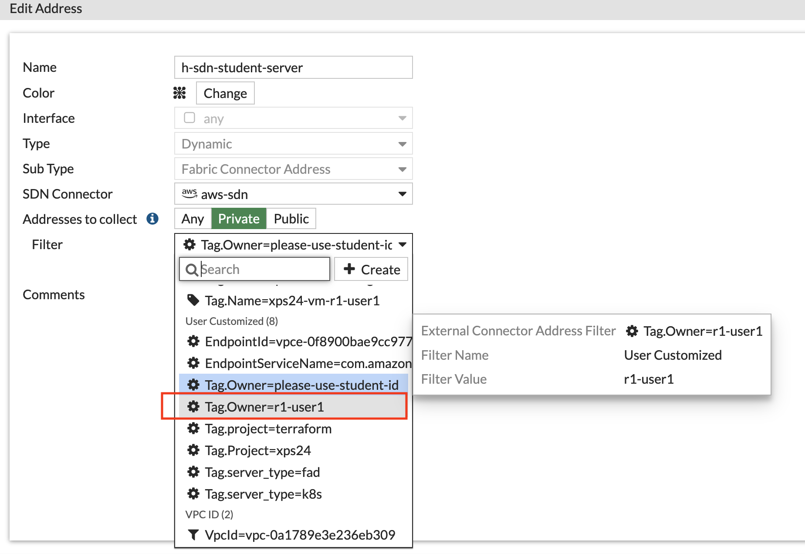</p>

En el momento que actualices el objeto con el Tag de Owner de tu usuario, el conector ya resolverá aquellas instancias que tengan asignado dicho Tag. En este laboratorio verás también las IPs asignadas a la instancia de firewall fortigate. Puedes comprobar las IPs que resuelve el objeto dinámico, manteniendo el cursor sobre el objeto dinámcio, aparecerá un menún contextual donde puedes hacer click en `View Matched Address`

<p align="center">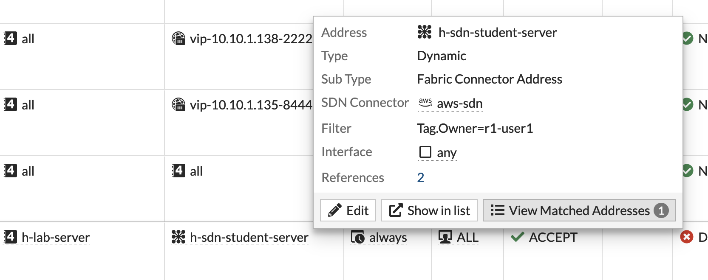</p>

De esta forma, la política que permite el tráfico desde el servidor del laboratorio, contra tu servidor de test, ya macheará correctamente la IP y dejará pasar el health-check que se realizá desde este. (Ya debes observar tráfico en la regla).

Y tu usario ya debe aparcer en la Leader Board:

<p align="center">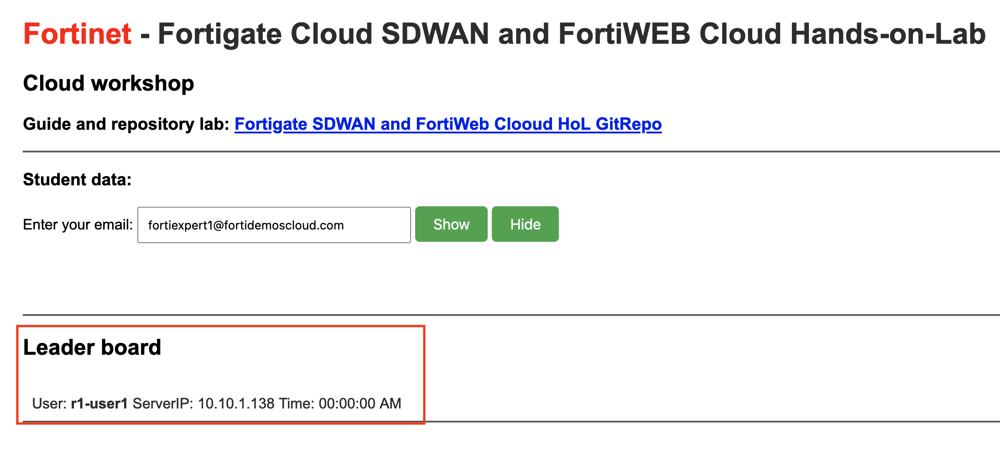</p>

- Si necesitas realizar algún throubleshooting sobre el testeo contra el servidor, puedes hacerlo con estos comandos via CLI:
```sh
execute ping 10.x.x.138
execute telnet 10.x.x.138 31000
diagnose sniffer packet any 'host 10.x.x.138' 4
```

### 1.4 Publicación de rutas en AWS TGW

> [!NOTE]
> Para este laboratorio no hemos habilitado el acceso a la consola de AWS, si tienes curiosidad por ver la configuración a nivel de AWS, pregunta a los monitores del curso que te lo podrán mostrar en su consola. 

Llegados a este punto, la conectividad entre el servidor del laboratorio y tu servidor de test se realiza de manera correcta. El servidor de laboratorio está desplegado en una VPC spoke atachada al TGW y aprende la red de vuestro servidor a través de los anuncios BGP que realizan los miembros del cluster de HUB de SDWAN. Esto se consigue con dos TGW attachment connect, uno a cada miembro del cluster, para poder establecer una sesión BGP contra el TGW. De esta forma, mediante routing dinámico el TGW aprende los CIDRs de los spokes SDWAN. 

Este se podría comprobar a nivel AWS dentro de la tabla de rutas del TGW asociada a esta VPC spoke, tabla de rutas `pre-inspection`:

<p align="center">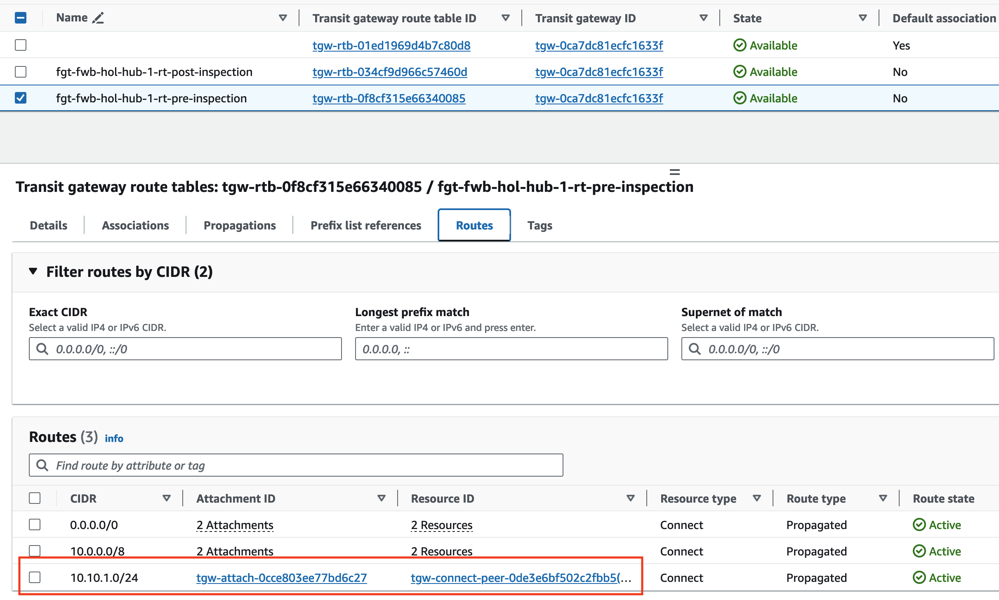</p>

> [!NOTE]
> En los despliegues SDWAN con HUB activo-activo, los spokes SDWAN se suelen configurar para conectar a las dos instancias al mismo tiempo. De forma que las dos anuncian los rangos IP del spoke a los BGP peers. En este caso, hemos balanceado via GSLB la conexión VPN entre las dos instancias, por lo que realmente el spoke está conectado a una única instancia al mismo tiempo. Además, hemos modificado los anuncios entre los HUBS (interconexión vxlan entre ellos), para que añadan una `community BGP` para poder identificar los anuncios internos iBGP entre ellos, el reenviar estos anuncios al TGW, los prefix con dicha comunity, se penalizan en el AS path. 

- Rutas anunciadas al TGW desde la instancia fortigate AZ1: 

<p align="center">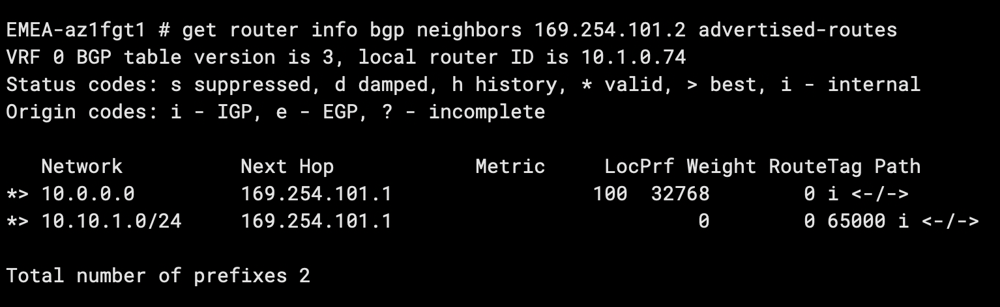</p>

- Rutas anunciadas al TGW desde la instancia fortigate AZ2: 

<p align="center">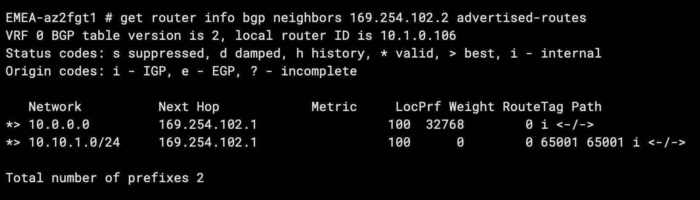</p>

Se observa como el prefix `10.10.1.0/24` se anuncia con un AS path `65000` desde el fortigate AZ2 y con AS path `65001 65001` desde el foritigate en AZ1.

> [!NOTE]
> Si quisieramos un balanceo de tráfico, usando la compatibilidad ECMP del TGW, no modificariamos los anuncios contra este. En estos escenrios, se puede dar routing asimétrico y debemos configurarar los Fortigates para poder manejar este tipo de tráfico.

### 1.5 Tráfico entre spokes SDWAN

- Conforme el resto de compañeros vayan desplegando sus Fortigates, se irán uniendo la red SDWAN, por lo que vuestro spoke irá aprendiendo nuevas rutas contra las redes que anuncian. (Red iBGP con HUB haciendo de Route Reflector)
- Comprobar la conectividad mediante ADVPN a las redes de los compañeros. Pregunta a algún compañero la IP de sus servidor interno e intenta hacer ping desde el Fortigate o desde vuestro servidor de laboratorio. (Ej. Puedes hacer ping a la IP del servidor de test del usuario 2 de la region 2 -> 10.20.2.138)
- Comprobar que se levanta un nuevo túnel de forma dinámica. 

<p align="center"></p>

## Laboratorio completado
Una vez concluido este laboratorio es hora de Pasar al laboratorio 2: [FortiADC](https://github.com/xpertsummit/xpertsummit24/tree/main/FortiADC)