# [FortiWeb Cloud](./)

En este laboratorio llevaremos a cabo las siguientes tareas:

- Creación de una nueva aplicación en FortiWeb Cloud con origen la aplicación web (DVWA) desplegada para cada usuario 
- Creación de una nueva aplicación en FortiWeb Cloud con origen la API (Swagger Pet Store API) desplegada para cada usuario (opcional)
- Añadiremos los perfiles de seguridad necesarios para proteger la aplicación Web y la API publicadas
- Creación de los FQDN asociados a cada aplicación para apuntar a la entrada de FortiWeb Cloud correspondiente
- Pruebas de carga contra FortiWeb para que aprenda los patrones de tráfico y pueda aplicar protección avanzada no basada en firmas, sino mediante ML
- Ejercicios de RedTeam para probar la eficacia de la protección

## 1. Conexión al servicio de FortiWeb Cloud
- Para acceder al servicio de FortiWeb Cloud se ha habilitado un acceso IAM donde cada usuario tendrá sus propias credenciales de acceso bajo una cuenta matriz donde se encuentra el servicio
- El acceso a FortiWeb Cloud puede llevarse a cabo desde la siguiente URL: [FortiWeb Cloud](http://www.fortiweb-cloud.com/)
- Seleccionamos la opción Login

<p align="center">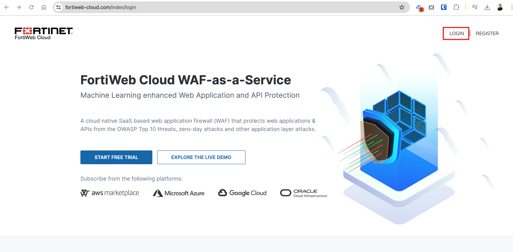</p>

- En las opciones de Login seleccionaremos la opción IAM Login y utilizaremos las credenciales que nos facilita el [portal](https://www.fortidemoscloud.com) 

<p align="center"></p>
<p align="center">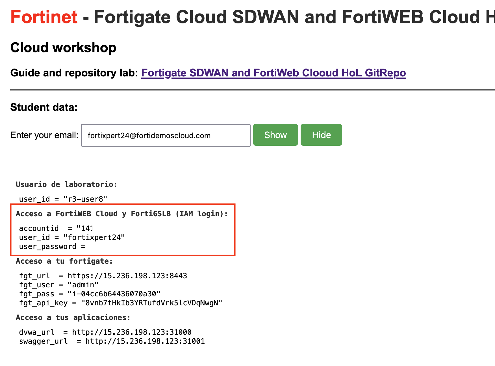</p>

Para un login inicial es necesario validar la cuenta de cada usuario para lo que se debe facilitar un token que se envía a la cuenta de correo del usuario. Cuando la cuenta de correo ya está validada, enviará directamente el token de acceso a la cuenta y lo solicitará. Para consultar dicho token se debe acceder al correo electrónico del usuario en el servidor https://mail.fortidemoscloud.com con las mismas credenciales de acceso que se han facilitado en el portal de inicio (###user_id###@fortidemoscloud.com)

Solicitud de validación inicial:
<p align="center">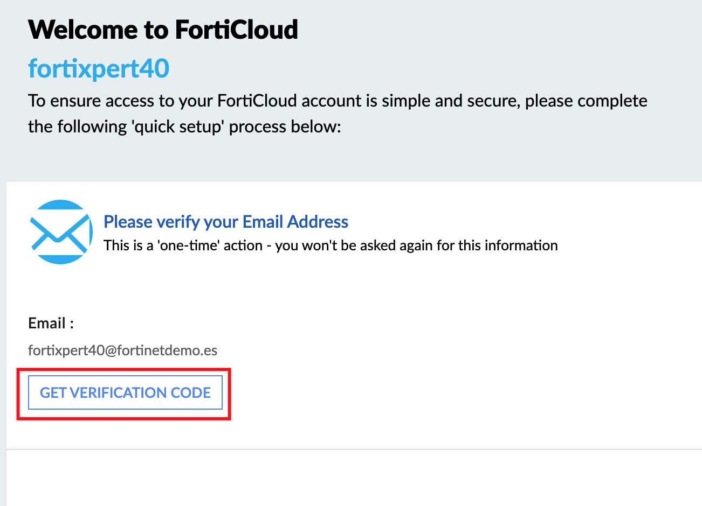</p>

Solicitud de token si la cuenta ya está validada:
<p align="center">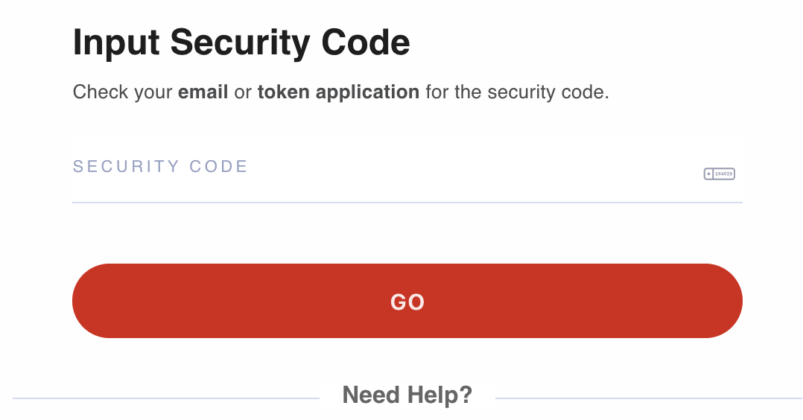</p>

## 2. Creación aplicación portal Web (DVWA)
- Comprueba que tu aplicación es accesible desde Internet. Puedes encontrar la URL a la misma en los datos del laboratorio: _Acceso a tus aplicaciones > dvwa_url_
- La creación de una nueva aplicación en FortiWeb Cloud es bastante sencilla. En este laboratorio realizaremos el alta vía GUI en el portal, pero se puede automatizar realizando peticiones a la API del servicio. [FortiWeb Cloud API reference](http://www.fortiweb-cloud.com/apidoc/api.html)
- En el menú de la izquierda seleccionaremos `Global > Applications`
- Dentro de la sección Aplicaciones, hacemos click en `ADD APPLICATION` para arrancar el Wizard de alta de la aplicación.

<p align="center">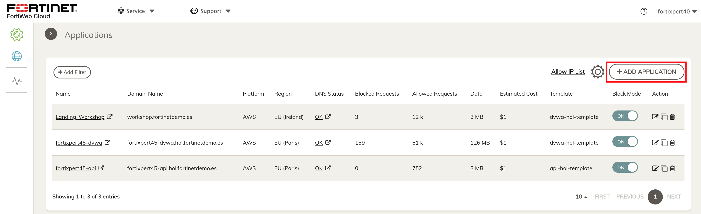</p>

- Wizard paso 1: Nombre de aplicación y dominio

    * **Web Application Name**: `user_id`-dvwa (Usuario FortiCloud asignado, ejemplo: fortixpert0-dvwa) - este valor no es más que un identificador dentro del portal para organizar las diferentes aplicaciones
    * **Domain Name**: `user_id`-dvwa.fortidemoscloud.com (ejemplo: fortixpert0-dvwa.fortidemoscloud.com) - este valor es el que va a determinar que FQDN va a tener nuestra aplicación y que posteriormente a nivel DNS redirigiremos a FortiWeb Cloud

<p align="center">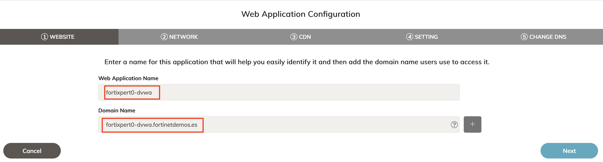</p>

- Wizard paso 2: Protocolo, puertos e IP origen del servidor
  
    * **Services allowed**: HTTP y HTTPS (FWB Cloud se apoya en Let's Encrypt o en certificados propios del cliente para asignar el certificado a la aplicación de forma automática)
    * **IP Address**: (IP pública de la aplicación, ejemplo: dvwa_url  = http://***15.188.151.180***:31000)
    * **Port**: 31000 (Puerto TCP, ejemplo: dvwa_url  = http://15.188.151.180:***31000*** ))
    * **Test Server**: (comprobar conexión al servidor usando HTTP)

> [!NOTE]
> Puedes obtener la IP pública de tu aplicación DVWA en los datos de laboratorio, en la parte de _"Acceso a tus aplicaciones > dvwa_url"_
> Los puertos de publicación `31000` y `31001` corresponde al acceso a la aplicación directamente a través de tu FortiGate sin pasar por el FortiADC.

<p align="center">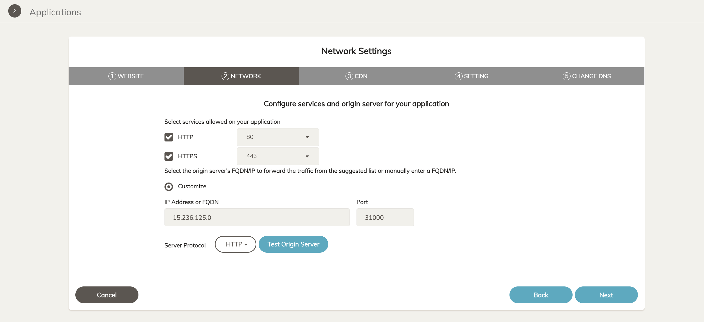</p>

No olvides testear el servidor para comprobar la correcta conexión entre FortiWeb Cloud y la aplicación:

<p align="center">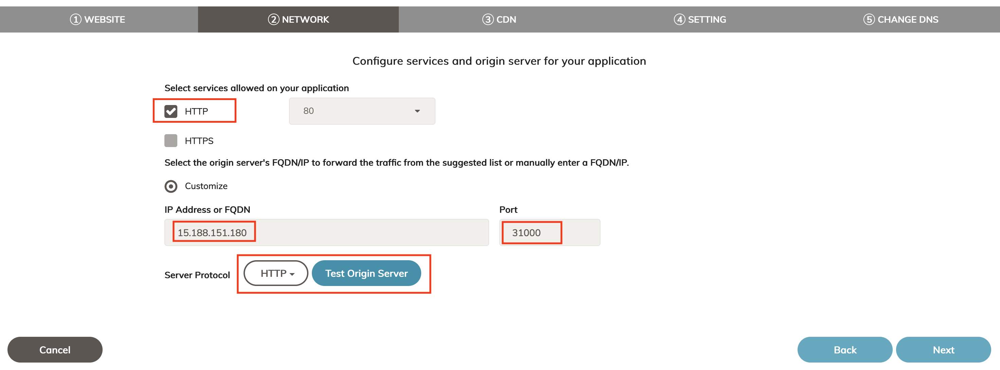</p>

- Wizard paso 3: CDN
  
    * **NO habilitaremos** servicios de CDN
    * La plataforma nos ofrecerá como ubicación para nuestra instancia la región más cercana a nuestra aplicación (para el workshop usamos las regiones de Irlanda, Londres y París)

<p align="center">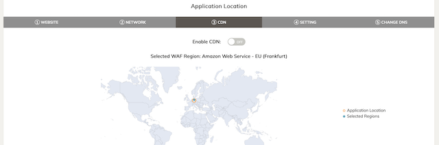</p>

- Wizard paso 4: Habilitar modo bloqueo y asignar template a la aplicación
  
    * Enable Block mode: ON (habilitamos la protección)
    * Template: `dvwa-hol-template` (selecionamos este template en el desplegable)
    * NOTA: el template permite definir qué funcionalidades de FortiWeb Cloud queremos habilitar para nuestra aplicación

<p align="center">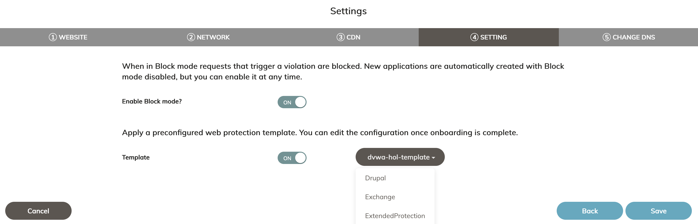</p>

- Completado:
  
    * El resultado es un nuevo FQDN que genera el servicio de FortiWeb Cloud para acceder a nuestra aplicación de forma segura a través del _Scrubbing Center_ correspondiente simplemente redirigiendo el tráfico a nivel DNS.
    * Desde el nuevo FQDN podremos acceder a nuestra aplicación a través de FortiWeb Cloud.

> [!TIP]
Copiar el nuevo FQDN para utilizar en el siguiente punto donde modificaremos los registros DNS de nuestro dominio

<p align="center">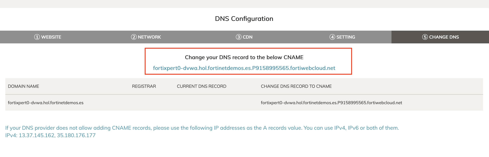</p>

- En el menú general de aplicaciones podremos ver cómo FortiWeb Cloud de forma automática ha seleccionado el _Scrubbing Center_ de FortiWeb Cloud más cercano a la aplicación y en el mismo Cloud Provider. A continuación se facilita un listado con los diferentes _Scrubbing Center_ disponibles a día de hoy ([FortiWeb Cloud scrubbing centers](https://docs.fortinet.com/document/fortiweb-cloud/24.2.0/user-guide/847410/restricting-direct-traffic-allowing-fortiweb-cloud-ip-addresses))

<p align="center">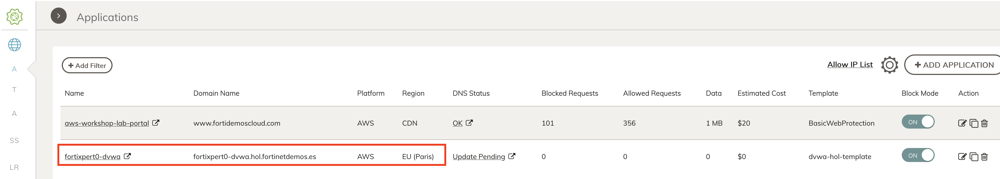</p>

### 2.1. Creación de nuevo CNAME para aplicación DVWA

Para facilitar el acceso seguro a la nueva aplicación a través de FortiWeb Cloud, vamos a añadir un nuevo CNAME en la zona DNS reservada para el workshop, que resuelva al FQDN proporciando por FortiWeb Cloud para nuestra aplicación. 

Para simplicar este proceso, desde el portal hemos añadido una función para crear las entradas DNS de manera automatizada. 

> [!WARNING]
> Si no has copiado el CNAME del endpoint que ha generado FortiWeb para la aplicación, puedes ir al menú "NETWORK > Endpoints" y recuperarlo.

- Ve al portal del curso e introduce los campos necesarios para crear una nueva entrada DNS:
  
    * new_record: `user_id`-dvwa (ejemplo: fortixpert1-dvwa)
    * fwb_endpoint: `<FortiWeb Cloud FQDN>` (ejemplo: fortixpert1-dvwa.fortidemoscloud.comP911111111.fortiwebcloud.net)

- Al darle a crear el resultado debe ser algo como esto:

<p align="center">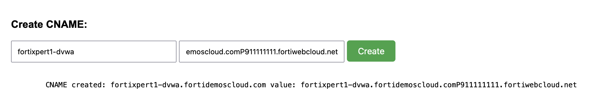</p>

- Una vez creada la entrada, ya puedes comprobar como la resolución de la nueva entrada _(ejemplo: fortixpert1-dvwa.fortidemoscloud.com)_, apunta al FQDN de la aplicación creada en FortiWeb Cloud.
- En este punto podrás comprobar al acceder a la aplicación a través de HTTPS como FortiWeb ha desplegado el certificado requerido para securizar la comunicación con la aplicación. Inicialmente se instala un certificado propio de FortiWeb y en cuestión de minutos se podrá comprobar como se despliega el certificado de Let's Encrypt de forma automatizada.

## 2.2. Red Team sobre Aplicación Web

En este punto vamos a validar el correcto funcionamiento de los mecanismos de seguridad que hemos habilitado en FortiWeb. Empezamos los ejercicios de Red Team sobre las aplicaciones publicadas!

## Injection atacks

Los ataques de inyección ocurren cuando un atacante envía ataques simples basados en texto que explotan la sintaxis del intérprete objetivo. Casi cualquier fuente de datos puede ser un vector de inyección, como variables de entorno, parámetros, servicios web externos e internos, y todo tipo de usuarios. Las fallas de inyección ocurren cuando una aplicación envía datos no confiables a un intérprete. Las fallas de inyección son muy comunes, especialmente en código heredado. A menudo se encuentran en consultas SQL, LDAP, Xpath o NoSQL; comandos del sistema operativo; analizadores XML, encabezados SMTP, argumentos de programa, etc. Las fallas de inyección son fáciles de descubrir al examinar el código, pero más difíciles de descubrir mediante pruebas. Los escáneres y los fuzzers pueden ayudar a los atacantes a encontrar fallas de inyección. La inyección puede provocar pérdida o corrupción de datos, falta de responsabilidad o denegación de acceso. La inyección a veces puede llevar a la toma completa del host. [OWASP A03_2021-Injection] (https://owasp.org/Top10/A03_2021-Injection/)

Accede a tu aplicación DVWA que has dado de alta en FortiWeb Cloud en pasos anteriores: _fortixpert#-dvwa.fortidemoscloud.com_

> [!NOTE]
> Si es la primera vez que accedes al portal: Username: "root" (con password en blanco) y selecciona la opción Create / Reset Database

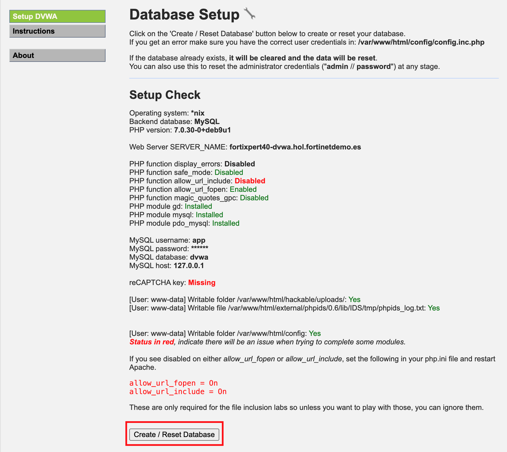

> Si ya has accedido y reseteado la base de datos el acceso es _Username: "admin" Password "password"_

### 2.2.1 SQL Injection attack (sitio desprotegido)

En primer lugar vamos a desactivar la seguridad de nuestro FortiWeb Cloud para permitir que se lleven a cabo los ataques.

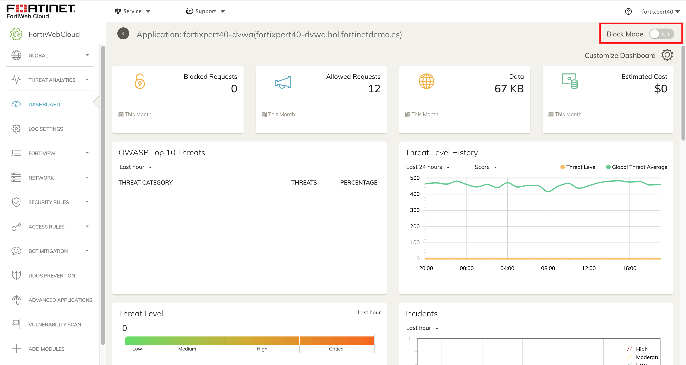

DVWA tiene un módulo simple utilizado para demostrar ataques de inyección SQL que espera valores de _user-id_ como enteros (por ejemplo, 1, 2, 3). La aplicación mostrará información sobre el usuario asociado con un user-id dado. En el siguiente ejercicio, inyectaremos comandos SQL para acceder a las contraseñas asociadas con los nombres de usuario.

Accede a tu aplicación DVWA que has dado de alta en FortiWeb Cloud en los pasos anteriores: _fortixpert#-dvwa.fortidemoscloud.com_

Selecciona nivel de seguridad bajo para evitar que la propia aplicación aplique controles de seguridad sobre los comandos que vamos a ejecutar

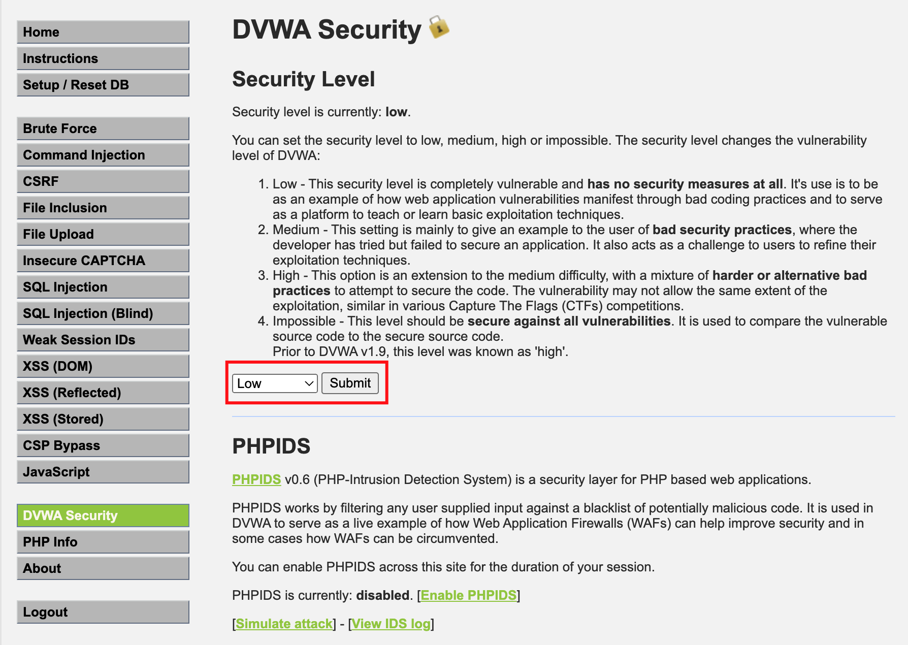

Accede a la sección SQL Injection e introduce el siguiente texto en el campo USER ID: `% 'or '1'='1' -- ';`

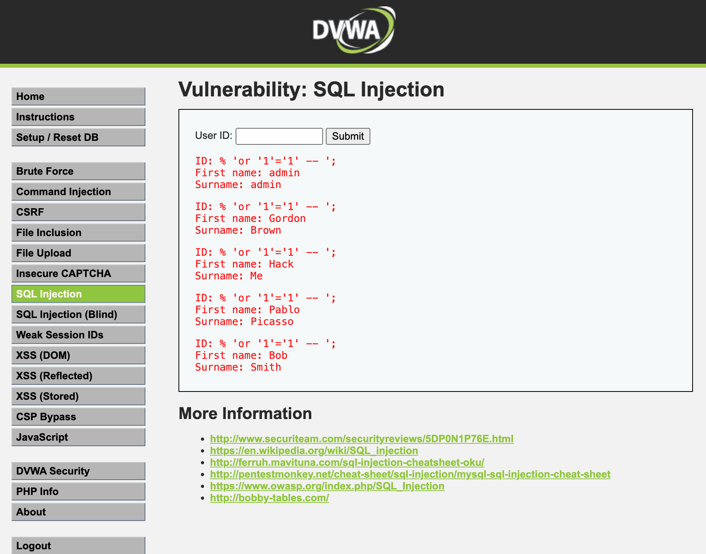

- Introduce el siguiente texto en el campo User ID: `'or '1'='1' union select null, user() #'`

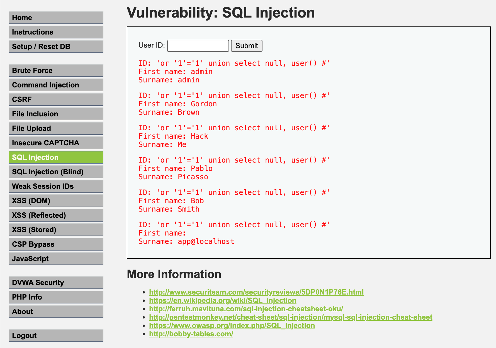

- Usa el siguiente comando para determinar el nombre de la base de datos: `%'or '1'='1' union select null, database() #'`

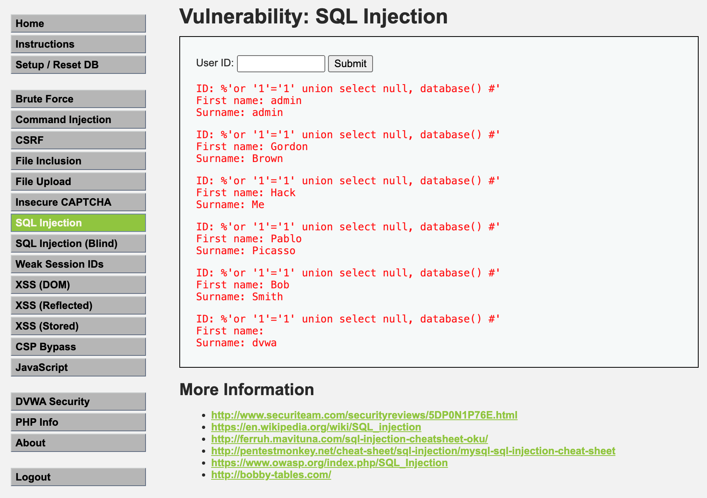

### 2.2.2 Injection atacks (sitio protegido)

¿Qué pasa si vuelves a lanzar los mismos ataques  pero activando el modo bloqueo en FortiWeb Cloud?

### 2.2.3 Command Injection attack (sitio desprotegido)

Recuerda desactivar la seguridad de nuestro FortiWeb Cloud para permitir que se lleven a cabo los ataques de este punto.

DVWA tiene un módulo simple utilizado para demostrar ataques de inyección de comandos que espera que un usuario introduzca una dirección IP. La aplicación luego enviará un ping a la dirección IP proporcionada. En el siguiente ejercicio, inyectaremos comandos además de la dirección IP que espera el módulo.

Accede a tu aplicación DVWA que has dado de alta en FortiWeb Cloud en pasos anteriores: _fortixpert#-dvwa.fortidemoscloud.com_

- Selecciona la opción Command Injection en el menú lateral
- Introduce el siguiente texto que va a permitir ejecutar un comando "pwd" y obtener información sobre el direcotrio donde esta la aplicación desplegada: `4.2.2.2; pwd`

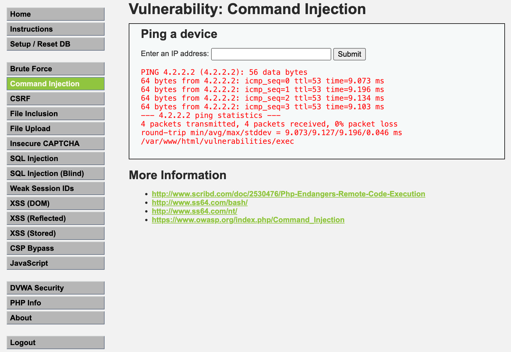

- Pregunta:
    
    - ¿Sería posible ejecutar un comando como “nc” (netcat) y abrir una shell en el sistema?
    - ¿Sería posible obtener la información de los usuarios que tiene el servidor?

<details>
  <summary>Compruébalo ;)</summary>
 127.0.0.1; cat /etc/passwd
</details>


### 2.2.4 Command Injection attack (sitio protegido)

¿Qué pasa si vuelves a lanzar los mismos ataques que en el punto pero activando el modo bloqueo en FortiWeb Cloud?

## Cross-Site Scripting (XSS) attacks 

Los ataques de Cross-Site Scripting (XSS) son un tipo de inyección en el cual se insertan scripts maliciosos en sitios web aparentemente benignos y de confianza. Los ataques XSS ocurren cuando un atacante utiliza una aplicación web para enviar código malicioso, generalmente en forma de script del lado del navegador, a un usuario final diferente. Las fallas que permiten que estos ataques tengan éxito son bastante comunes y pueden ocurrir en cualquier lugar donde una aplicación web permita la entrada de un usuario dentro de la salida que genera, sin validar ni codificarla.

Un atacante puede usar XSS para enviar un script malicioso a un usuario desprevenido. El navegador del usuario final no tiene forma de saber que el script no debe ser confiable y ejecutará el script. Debido a que el navegador cree que el script proviene de una fuente confiable, el script malicioso puede acceder a cualquier cookie, token de sesión u otra información sensible retenida por el navegador y utilizada con ese sitio. Estos scripts incluso pueden reescribir el contenido de la página HTML.

Si bien el objetivo de un ataque XSS siempre es ejecutar JavaScript malicioso en el navegador de la víctima, existen algunas formas fundamentalmente diferentes de lograr ese objetivo.

Los ataques XSS a menudo se dividen en tres tipos: XSS Persistente: donde la cadena maliciosa proviene de la base de datos del sitio web. XSS Reflejado: donde la cadena maliciosa proviene de la solicitud del usuario. El sitio web luego incluye esta cadena maliciosa en la respuesta enviada de vuelta al usuario. XSS basado en DOM: donde la vulnerabilidad está en el código del lado del cliente en lugar del código del lado del servidor. El XSS basado en DOM es una variante tanto de XSS persistente como de XSS reflejado. En un ataque XSS basado en DOM, la cadena maliciosa no se analiza realmente hasta que se ejecuta el JavaScript legítimo del sitio web. (https://owasp.org/www-community/attacks/xss/) Aquí hay un excelente análisis sobre XSS: https://excess-xss.com/

### 2.2.5 XSS attack (sitio desprotegido)

Recuerda desactivar la seguridad de nuestro FortiWeb Cloud para permitir que se lleven a cabo los ataques de este punto.

Accede a tu aplicación DVWA que has dado de alta en FortiWeb Cloud en pasos anteriores: _fortixpert#-dvwa.fortidemoscloud.com_

- Haz clic en la pestaña XSS (Reflejado) a la izquierda para lanzar el módulo.
- Introduce un texto, ejemplo "john", para probar la funcionalidad del módulo.
- Vas a lanzar un XXS attach injectando el siguiente texto en el campo “what’s your name? “Field: `<script>alert(12345)</script>`

<p align="center">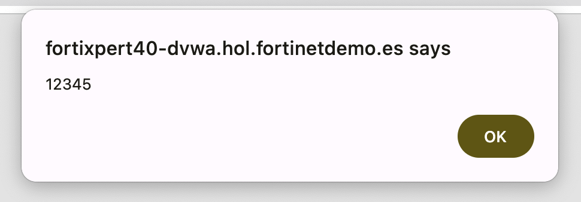</img></p>

### 2.2.6 XSS attack (sitio protegido)

¿Qué pasa si vuelves a lanzar los mismos ataques pero activando el modo bloqueo en FortiWeb Cloud?

### 2.2.7 Credential Stuffing

El ataque de credential stuffing es una técnica utilizada por ciberdelincuentes para intentar obtener acceso no autorizado a cuentas de usuarios. Este tipo de ataque se basa en el hecho de que muchas personas reutilizan sus credenciales, como nombres de usuario y contraseñas, en múltiples servicios.

El proceso típico de un ataque de credential stuffing implica lo siguiente:

   1. ***Recopilación*** de credenciales: Los ciberdelincuentes obtienen grandes cantidades de nombres de usuario y contraseñas que han sido previamente filtrados o comprometidos. Estas credenciales filtradas se pueden encontrar en foros de hacking, mercados clandestinos en la deepweb u otras fuentes.

   2. ***Automatización*** del ataque: Utilizando herramientas automatizadas, los atacantes prueban estas credenciales filtradas contra diversas plataformas en línea, como sitios web, servicios de correo electrónico o redes sociales. El objetivo es encontrar combinaciones de nombre de usuario y contraseña que coincidan con las cuentas de los usuarios comprometidos.

   3. ***Acceso no autorizado***: Si el ataque tiene éxito y se encuentra una combinación válida de credenciales, los ciberdelincuentes pueden obtener acceso no autorizado a la cuenta afectada. Dependiendo de la naturaleza del ataque, podrían robar información personal, realizar acciones maliciosas en nombre del usuario o comprometer aún más la seguridad de la cuenta.

Para protegerse contra este tipo de ataques mediante FortiWeb Cloud, lo podemos hacer activando la protección frente a Credential Stuffing para ello lo primero que tenemos que hacer es activar el módulo de Account Takeover en “Add modules”:

<p align="center">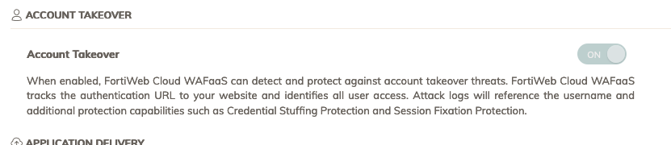</img></p>

En el submenu: Account Takeover

Configura los siguientes valores:
* Authentication URL: /login.php
* Log Off URI: /logout.php
* Username Field Name: username
* Password Field Name: password
* Session ID Name: PHPSESSID
* Redirect URL: index.php
* Credential Stuffing Protection: ON

* No nos olvidemos en dar a "***SAVE***"

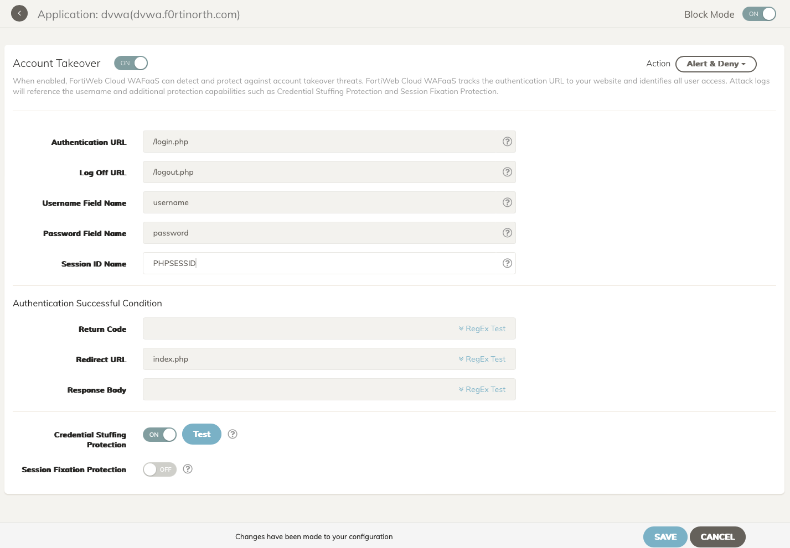
## 2.3 Observabilidad en FortiWeb

Una de las caracteristicas principales de FortiWeb Cloud, es [Threats Analytics](https://docs.fortinet.com/document/fortiweb-cloud/24.2.0/user-guide/920966/threat-analytics), que utiliza algoritmos de aprendizaje automático para identificar patrones de ataque en todos los activos de tu aplicación y los agrupa en incidentes de seguridad, asignándoles una gravedad. Ayuda a distinguir las amenazas reales de las alertas informativas y los falsos positivos, permitiéndote concentrarte en las amenazas que son importantes.

Principales ventajas:

    - Simplifica la detección y respuesta a amenazas.
    - Acelera la investigación de alertas de seguridad.
    - Ayuda a los analistas a concentrarse en las amenazas más importantes.
    - Proporciona sugerencias para fortalecer la seguridad basadas en hallazgos.
    - Ingiere eventos de todos tus entornos de nube híbrida.
    - Alivia la fatiga por alertas.

El acceso a Threat Analytics se realiza a través del portal de FortiWeb Cloud, donde encontrarás los registros de ataques.

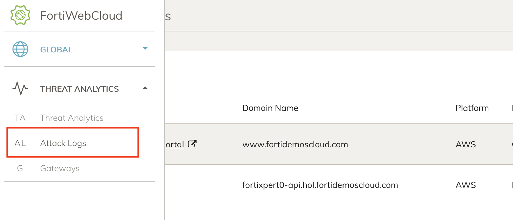

Chequea la IP desde la que se han lanzado los ataques.

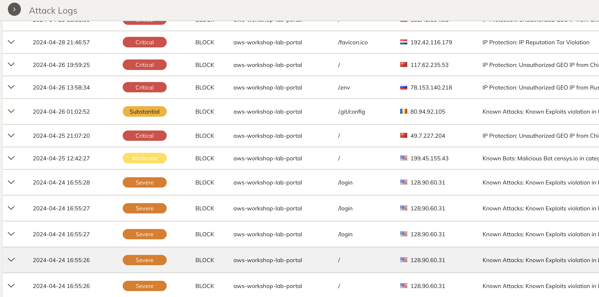

También desde `FortiView` dentro de cada una de las aplicaciones, es posible encontrar información detallada sobre los ataques detectados. 

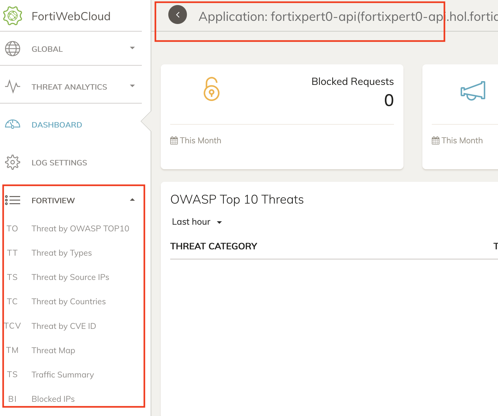

### Afinamiento de falsos positivos

Desde los logs de ataques, es posible crear excepciones de una manera sencilla.

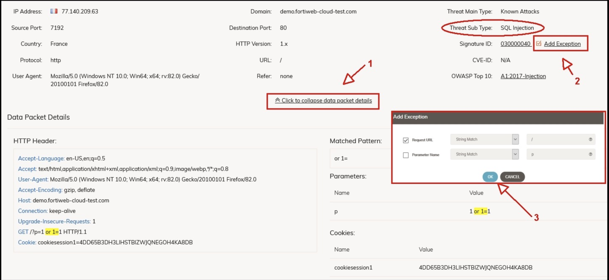

Todas las excepciones configuradas se reflejan desde `SECURITY RULES > Known Attacks`. Si el log de la aplicación, al que estamos creando la excepción, tiene asigando un template, estas quedarán reflejadas en dicho template y será donde deberiamos resetearlas para volver para la configuración inicial del mismo.

> [!NOTE]
> La creación de la aplicación API es opcional, si vas mal de tiempo puedes pasar al laboratorio 4: [FortiDAST](https://github.com/xpertsummit/xpertsummit24/tree/main/FortiDAST)

### 3 Creación de aplicación API (Swagger Pet Store)

> [!NOTE]
> El alta de la aplicación de API es opcional para este laboratorio.

- Comprueba que tu aplicación es accesible desde Internet, puedes encontrar la URL a la misma en los datos del laboratorio: _Acceso a tus aplicaciones > swagger_url_

Para dar de alta la aplicación, seguirás los mismos pasos que en el punto anterior para el portal Web DVWA. 

***Repetir los mismos pasos que en el [punto 2](#2-creación-aplicación-portal-web-dvwa) con las variaciones indicadas a continuación***

Cosas que debes tener en cuenta:

- Web Application Name: `user_id`-api (Usuario FortiCloud asignado, ejemplo: _fortixpert0-api_)
- Domain Name: `user_id`-api.fortidemoscloud.com (ejemplo: _fortixpert0-api.fortidemoscloud.com_)

- Template de protección a aplicar en FortiWeb Cloud: ***api-hol-template***

- DNS Alias: `user_id`-api (ejemplo: _fortixpert0-api_)

### 3.1. Creación de nuevo CNAME para aplicación API

Puedes repetir los pasos en el [punto 2.1](#21-creación-de-nuevo-cname-para-aplicación-dvwa)

> [!WARNING]
> Si no has copiado el CNAME del endpoint que ha generado FortiWeb para la aplicación, puedes ir al menú "NETWORK > Endpoints" y recuperarlo.

- Ve al portal del curso e introduce los campos necesarios para crear una nueva entrada DNS:
  
    * new_record: `user_id`-api (ejemplo: fortixpert1-api)
    * fwb_endpoint: `<FortiWeb Cloud FQDN>` (ejemplo: fortixpert1-api.fortidemoscloud.comP911111111.fortiwebcloud.net)

- Al darle a crear el resultado debe ser algo como esto:

<p align="center"></p>

- Una vez creada la entrada, ya puedes comprobar como la resolución de la nueva entrada _(ejemplo: fortixpert1-api.fortidemoscloud.com)_, apunta al FQDN de la aplicación creada en FortiWeb Cloud.
- En este punto podrás comprobar al acceder a la aplicación a través de HTTPS como FortiWeb ha desplegado el certificado requerido para securizar la comunicación con la aplicación. Inicialmente se instala un certificado propio de FortiWeb y en cuestión de minutos se podrá comprobar como se despliega el certificado de Let's Encrypt de forma automatizada.

## 3.2 Entrenamiento del módelo ML de API

El template de seguridad aplicado para la aplicación API, lleva activada la protección de APIs mediante Machine Learning. Para que el modelo pueda aprender el patrón de tráfico de la aplicación, vamos a forzar cierto tráfico mediante un par de scripts que permiten simular lo que sería un uso normal de la API. Para revisar el template podeis hacerlo desde el menú de la izquierda `GLOBAL > Templates`

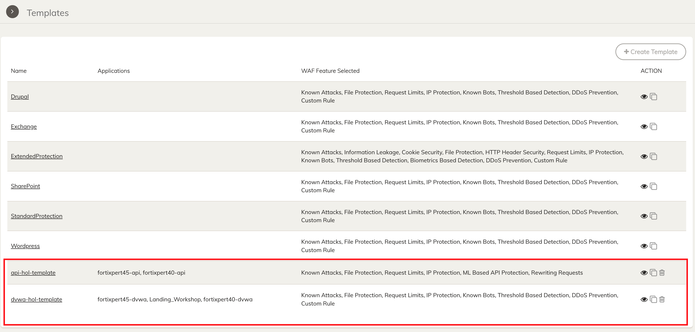

Seleccionar el template `api-hol-template` y revisar los profile de seguridad aplicados en el menú de la izquierda, en este caso el que aplica a este punto es el de `API PROTECTION > ML Based API Protection`

### 3.2.1 Lanzar los scripts de entrenamiento y aprendizaje

- En la carpeta scripts de la guía del laboratorio, podrás encontrar script en bash o PowerShell para poder ser ejecutos en entornos Windows o Mac/Linux.
- Copia los scripts para ejecutarlos desde tu PC. (Si tienes algún problema con esto puedes usar el servidor de pruebas habilitado, pregunta para que te demos acceso a un entorno Linux).
- Debes copiar dos scripts, que serán los que lancen las simulaciones del entrenamiento via GET y POST. 

- Añade los permisos de ejecución a los scripts a ejecutar (caso de MAC o Linux):
```sh
chmod +x fwb_training_get.sh
chmod +x fwb_training_post.sh
```
- Ejecutar los scripts: (debes introducir la URL de tu aplicación API en formato correcto, ejemplo: https://fortixpert0-api.fortidemoscloud.com)
```sh
./fwb_training_get.sh <URL de la API> 
```
```sh
./fwb_training_post.sh <URL de la API> 
```

### 3.2.2 Comprobación de los patrones aprendidos

**IMPORTANTE: los resultados del aprendizaje tarda unos minutos en mostrarse en la plataforma, no desesperes. Si es tu caso, puedes avanzar en el laboratorio y luego volver a este punto después**

- Iremos a la sección API Collection de la aplicación, en el menú de la izquierda `API PROTECTION > ML Based API Protection`

<p align="center">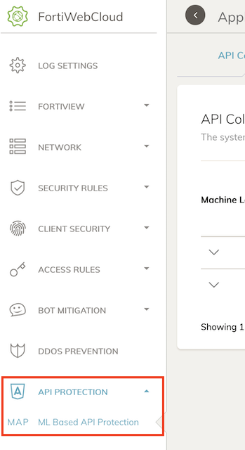</p>

- Cuando haya pasado un tiempo desde el lanzamiento de los scripts de entrenamiento se presentarán los patrones de tráfico aprendidos por el modelo. 

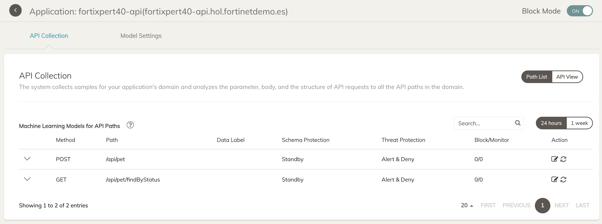

- Se puede consultar el esquema API aprendido, incluso lo podemos descargar si fuera necesario, cambiando la vista a `API View` en la parte de la derecha. 

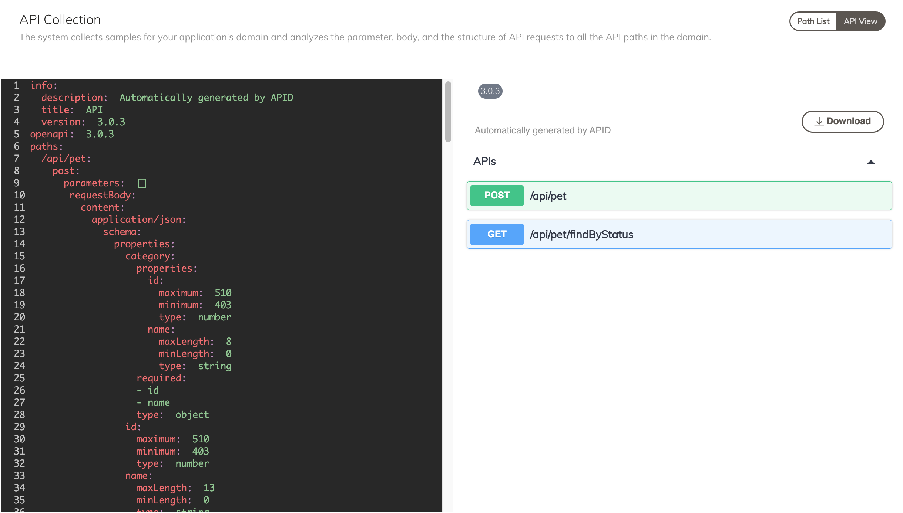

### 3.2.3 Aplicar bloqueo en las llamadas que no cumplan con el esquema

Por defecto, el esquema aprendido deja la protección en standby, de forma que las peticiones que no cumplan con dicho esquema, no son bloqueadas ni alertadas. Podemos cambiar este comportamiento en `Schema Protection`.

- Dentro de `API Collection`, donde aparecen los modelos aprendidos de API Paths, podemos dar a editar el comportamiento de protección, dandole al boton de editar que aparece a la derecha en la columna Action. 

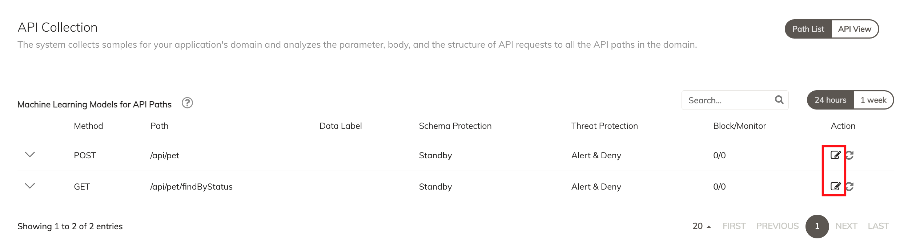

- Dentro de la customización del API Path aprendido, entre otras cosas podemos modificar el comportamiento de protección, seleccionándolo en el desplegable de arriba a la derecha. 

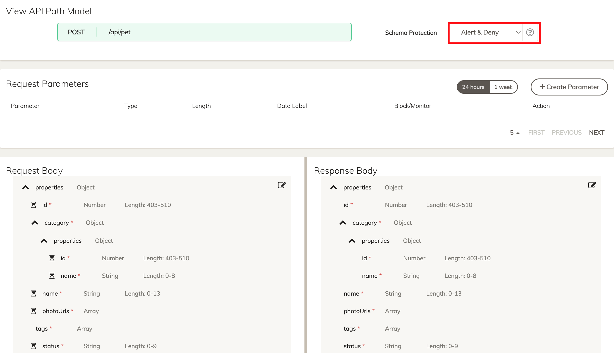

- Para confirmar que el número de muestras recibidas es suficiente debemos comprobar el estado de las diferentes áreas de nuestra API

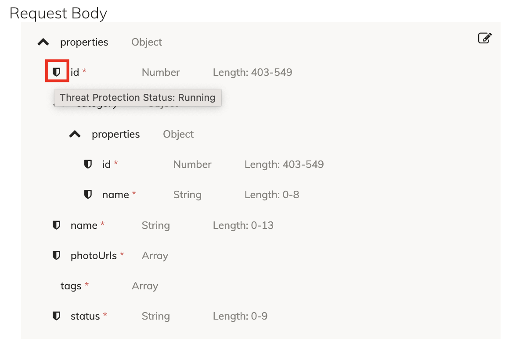

## 3.2.4 Ataques sobre la API

En este apartado vamos a comprobar, como de forma automática, FortiWeb Cloud puede proteger las llamadas a la API, en función a lo aprendido en los patrones de tráfico y al esquema Swagger que ha definido. 

En el punto 3.2.3, se ha modificado el comportamiento de protección frente a llamadas que no cumplan con el esquema. Comprobar este punto para esperar un comportamiento u otro en los siguientes test.

### 3.2.4.1 Query Parameter Violation

- "status" JSON parameter is missing in the JSON request and is blocked by FortiWeb-Cloud. The expected result is a Request query validation failed status.

```sh
curl -v -X 'GET' 'https://fortixpert0-api.fortidemoscloud.com/api/pet/findByStatus?' -H 'Accept: application/json' -H 'Content-Type: application/json'
```

### 3.2.4.2 URL Query Parameter Long

- "status" URL query parameter is too long. The expected result, JSON parameter length violation.

```sh
curl -v -X 'GET' 'https://fortixpert0-api.fortidemoscloud.com/api/pet/findByStatus?status=ABCDEFGHIJKL' -H 'Accept: application/json' -H 'Content-Type: application/json'
```

### 3.2.4.3 URL Query Parameter Short

- "status" URL query parameter is too short. The expected result is a parameter violation.

```sh
curl -v -X 'GET' 'https://fortixpert0-api.fortidemoscloud.com/api/pet/findByStatus?status=A' -H 'Accept: application/json' -H 'Content-Type: application/json'
```

### 3.2.4.4 Cross Site Script in URL

- "status" URL query parameter will carry a Command Injection attack. The expected result is a known signature violation.
    
```sh
curl -v -X 'GET' 'https://fortixpert0-api.fortidemoscloud.com/api/pet/findByStatus?status=<script>alert(123)</script>'  -H 'Accept: application/json' -H 'Content-Type: application/json'
```

### 3.2.4.5 Cross Site Script in Body

- "status" JSON body will carry an XSS attack. The expected result, the attack is being blocked by Machine Learning.

```sh
curl -v -X 'POST' 'https://fortixpert0-api.fortidemoscloud.com/api/pet' -H 'accept: application/json' -H 'Content-Type: application/json' -d '{"id": 111, "category": {"id": 111, "name": "Camel"}, "name": "FortiCamel", "photoUrls": ["WillUpdateLater"], "tags": [ {"id": 111, "name": "FortiCamel"}], "status": "<script>alert(123)</script>"}'
```

### 3.2.4.6 Zero Day Attacks

We will now use some sample Zero Day Attacks.

- Cross Site Script in the Body

```sh
curl -v -X 'POST' 'https://fortixpert0-api.fortidemoscloud.com/api/pet' -H 'accept: application/json' -H 'Content-Type: application/json' -d '{"id": 111, "category": {"id": 111, "name": "Camel"}, "name": "javascript:qxss(X160135492Y1_1Z);", "photoUrls": ["WillUpdateLater"], "tags": [ {"id": 111, "name": "FortiCamel"}], "status": "available”}
```

## Laboratorio completado
Una vez concluído este laboratorio es hora de pasar al laboratorio 4: [FortiDAST](https://github.com/xpertsummit/xpertsummit24/tree/main/FortiDAST)


