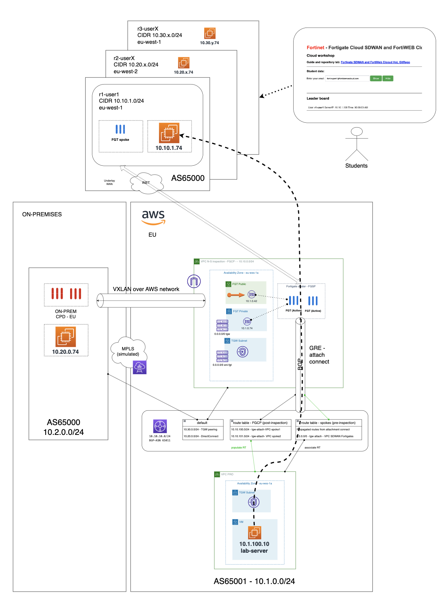
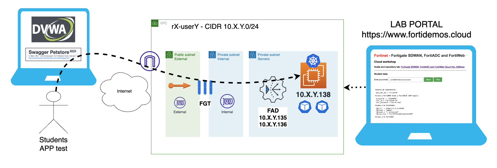

# Hands on Lab Cloud Networking y Seguridad Aplicaciones Web & API

## Objetivo del laboratorio

El objetivo de estos laboratorios es conocer la propuesta de valor de Fortinet para proteger una aplicación web y una API desplegadas en un public cloud e integrada en una architectura de comunicaciones SDWAN multi-HUB. Las soluciones que harán posible esta protección son: FortiGate, FortiWeb Cloud, FortiADC, FortiDAST y FortiGSLB. En el workshop cada participante cuenta con un entorno en AWS compuesto de un fortigate publicando dos aplicaciones desplegadas en un nodo de Kubernetes. Durante el workshop se trabajará en conocer mejor la arquitectura SDWAN e integración con los servicios de routing del cloud provider y se llevará a cabo la publicación de las aplicacones a través de FortiWeb Cloud. En el proceso aprenderás a entrenar el modelo de Machine Learning (ML) de la API para conocer el esquema OpenAPI de la misma y aplicar mecanismos de protección sobre el mismo y también cómo proteger portales web frente a ataques TOP10 OWASP y otros ataques sofisticados.

Al margen de ello podremos comprobar el valor añadido que puede aportar nuestro servicio FortiDAST para evaluar de forma continua la postura de seguridad de nuestras aplicaciones y APIs.

El formato del laboratorio consiste en 2 laboratorios diferenciados cuyos datos de acceso se pueden encontrar en la siguiente URL introduciendo el token que se habrá facilitado previamente a cada asistente por correo electrónico.

- https://www.fortidemoscloud.com

## Indice de laboratorios a completar

* [FortiGate](./FortiGate): simplificación del Cloud Networking con SDWAN y conectores SDN
* [FortiADC](./FortiADC): balanceo y protección de aplicaciones en entorno hibrido
* [FortiWeb](./FortiWeb): protección WEB y protección avanzada de APIs
* [FortiDAST](./FortiDAST): análisis de vulnerabilidades de las aplicaciones
* [FortiGSLB](./FortiGLSB): balanceo global de aplicaciones (opcional)

## Diagrama general de los laboratorios

A continuación se recoge el diagrama general de los laboratorios disponibles para cada usuario:

- Un FortiGate con conexión SDWAN dual HUB, con HUBs desplegados en entorno AWS.
- Un FortiADC desplegado detrás del Fortigate con acceso a Internet a través de este. 
- Un nodo de Kubernetes con dos aplicaciones desplegadas y accesibles por el Fortigate y el FortiADC. 
- Dicho FortiGate dispone de una IP publica para publicar dichas aplicaciones en los puertos 31000 y 31001.
- Acceso a un entorno de FortiWEB cloud para poder dar de alta aplicaciones. 
- Acceso a un entonrio de FortiGSLB para poder dar de alta nuestras entradas DNS y configurar servicios GSLB. 

## [FortiGate](./FortiGate)

En este laboratorio llevaremos a cabo las siguientes tareas:

- Conexión a FortiGate y troubleshooting de conectividad SDWAN.
- Configuración de objetos dinámicos con metadtados del entorno Cloud. 
- Revisión de políticas y routing.

## [FortiADC](./FortiADC)

En este laboratorio llevaremos a cabo las siguientes tareas:

- Creación de un pool de servidores usando el conector SDN y el conector de Kuberntes. 
- Creación de los Virtual Servers de cada una de las aplicaciones.
- Creación de perfiles WAF de protección de la aplicación. 
- Entender las nuevas funcionalidades de Adaptative Learning y como FortiADC sugiere protecciones mediante ML. 
- Publicación de las aplicaciones. 

## [FortiWeb](./FortiWeb)

En este laboratorio llevaremos a cabo las siguientes tareas:

- Creación de una nueva aplicación en FortiWeb Cloud con origen la aplicación web (DVWA) desplegada para cada usuario 
- Creación de una nueva aplicación en FortiWeb Cloud con origen la API (swagger pet store API) desplegada para cada usuario
- Añadiremos los perfiles de seguridad necesarios para proteger la aplicación Web y la API publicadas
- Creación de los FQDN asociados a cada aplicación para apuntar a la entrada de FortiWeb Cloud correspondiente
- Pruebas de carga contra FortiWeb para que aprenda los patrones de tráfico pueda aplicar protección avanzada no basada en firmas, mediante ML
- Ejercicios de RedTeam para probar la eficacia de la protección

## [FortiDAST](./FortiDAST)

En este laboratorio llevaremos a cabo las siguientes tareas:

- Integración de FortiWeb Cloud con el servicio de análisis de vulnerabilidades de FortiDAST
- Lanzamiento de escaneo sobre las aplicaciones desplegadas para identificar potenciales riesgos de las aplicaciones
- Análisis de los resultados de los escaneos

## [FortiGSLB](./FortiGSLB)

En este laboratorio llevaremos a cabo las siguientes tareas:
- Dar de alta nuestra aplicación como server del servicio GSLB.
- Añadir nueevo virtual server al servicio GSLB ya configurado en FortiGSLB.

## Support
This a personal repository with goal of testing and demo Fortinet solutions on the Cloud. No support is provided and must be used by your own responsability. Cloud Providers will charge for this deployments, please take it in count before proceed.

